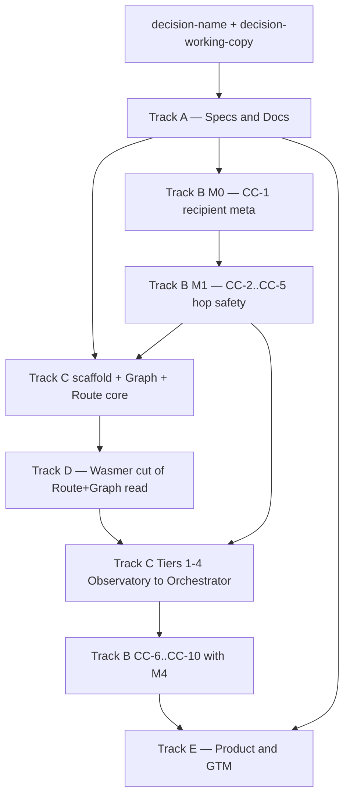

# comPASS Master Orchestration

## Purpose

Stand up **comPASS** — a capability-routed model-selection engine — as a sibling of **comPREssOR**, and land the compressor hop-safety work that makes per-turn routing inside one session correct.

comPASS measures model capability against a task taxonomy derived from the user's own work, maintains that measurement as a **bitemporal capability graph**, and routes each request to the endpoint that maximizes expected quality subject to a budget constraint. The compressor is the structural reason this is possible: the forward channel is unconditionally discrete text (`SampledPayload(kind="text", ...)` from the vocabulary bridge). Session state is a bounded, model-agnostic digest. Switching models mid-session therefore costs the forward budget (default 1024 tokens, `CHAT_COMPRESSOR_FORWARD_BUDGET`), not transcript length.

This master plan does **not** implement code. It is the program index. Child plans are independent `*.plan.md` files. Execute them in the build order below. Do not collapse tracks into one agent run.

**Ground truth (read first, do not paraphrase away the constraints):**

- Prototype spec: [`/Users/rosario/work/comPASS/PROTOTYPE.md`](/Users/rosario/work/comPASS/PROTOTYPE.md)
- Session summary: [`/Users/rosario/work/comPASS/SUMMARY/2026-09-03-comPASS-prototype-session.md`](/Users/rosario/work/comPASS/SUMMARY/2026-09-03-comPASS-prototype-session.md)
- Canonical compressor: `git@github.com:soltrinox/comPREssOR.git` checked out at [`/Users/rosario/work/comPREssOR`](/Users/rosario/work/comPREssOR) (engine **0.2.0**, branch `main`)
- Sibling product (this program): [`/Users/rosario/work/comPASS`](/Users/rosario/work/comPASS)
- Plan index: [`/Users/rosario/work/comPASS/PLANS.md`](/Users/rosario/work/comPASS/PLANS.md)

**Working name:** `comPASS` (placeholder — Appendix A.1 of the prototype). Sister to `comPREssOR`. Three planes: **Probe / Graph / Route**. Four shippable tiers: **Observatory / Advisor / Router / Session orchestrator**.

## Locked defaults

These are not open for re-litigation inside a track unless the named decision record is updated first.

| Default | Value |
|---|---|
| Product placeholder | `comPASS` until `decision-name` closes |
| Canonical compressor remote | `git@github.com:soltrinox/comPREssOR.git` |
| Canonical compressor path | `/Users/rosario/work/comPREssOR` |
| Engine version in scope | `0.2.0` on `main` |
| Forbidden implementation tree | `/Users/rosario/work/CHAT-COMPRESSOR` (untracked, engine `0.1.3`, pre-sanitization) |
| Related distribution (do not confuse) | `soltrinox/OPENCLAW-comPREssOR` |
| New sibling package name (until rename) | `compass-router` in `pyproject.toml`, `requires-python >=3.11` |
| Planes | Probe (daemon, credentials, never on prompt path) / Graph (bitemporal store + bandit) / Route (hot path, fail-open) |
| Tiers | 1 Observatory, 2 Advisor, 3 Router, 4 Session orchestrator |
| Scoring | `score(m, c) = E[quality(m, c)] − λ · E[cost(m, c)]` |
| Bandit | Thompson sampling (UCB allowed as fallback) over `(TaskClass, ModelVersion)` arms |
| Route failure | Fail-open to a configured default. Router must never be why a request fails. |
| Probe failure isolation | Probe never in a prompt path. No provider keys in the hook process or in the browser WASM module. |
| Schema | New sibling `model-graph.v1.json`. Do **not** widen `ctx-graph.v1` node/edge enums. |
| Bitemporality | Every graph node carries `valid_start`, `valid_end`, `status` in `("active", "superseded", "deprecated")` |
| Compatibility | Additive or env-gated. Absent recipient info, compressor paths behave exactly as 0.2.0. |
| Sanitization | No machine-specific absolute paths (`/Users/rosario/...`) in compressor **code**. Canonical 0.2.0 already stripped them. |
| Proof | Timestamped `.log.txt` under `test-results/<topic>/`, falsifiable claims, FULL / PARTIAL / NOT_RUN grades |
| Equivalence claim | Outcome-equivalence band on oracle-bearing task classes. **Never** identical text. |
| Wasmer cut | Route + Graph **read** path. Probe stays native sidecar. |

## Have (do not rebuild)

Reuse. Do not re-derive these from first principles.

### From comPREssOR 0.2.0 (canonical)

- Discrete-text forward channel: `engine/src/chat_compressor/translate/vocab_bridge.py` — this is why hopping is possible.
- Two-tier persistence: `StateStore` in `store.py` (SQLite metadata + mmap-backed safetensors). Mirror this in the Graph plane.
- Bitemporal context graph: `graph.py` `CtxGraph` with `valid_start` / `valid_end` / `status` / `supersede`. Borrow the pattern; do not widen the enums (`Turn`, `Topic`, `Fact`, `OpenItem`, `Event` and `mentions`, `contains`, `continues`, `supersedes`, `derived_from`).
- Implicit reward surfaces already on the graph: `openitem_signature()`, `supersede_count()`, `sample_for` reading them each turn.
- Fail-open hook discipline: `hook_cli.py` — every handler catches broadly, logs, returns the event-safe default. Copy this discipline into Route.
- Hook return shapes (fixed, no model field): `beforeSubmitPrompt` → `{"continue": true}` plus optional `additional_context`; `sessionStart` → `{"additional_context": ""}`. In-IDE integration is **advisory only**.
- Classification features to reuse, not replace: `extractive.keyword_set`, `chunks.chunk_text`, `rank.rank_chunks`.
- Model-id normalization: `live_models.extract_model_ids`, `resolve_model_ids` (ListResult/dict/iterable/SDKModel variants, alias fallbacks, `missing` list).
- Env-knob pattern: `CHAT_COMPRESSOR_CROSS_TURN_DEDUP`, `CHAT_COMPRESSOR_INJECT_P1`, documented in `engine/env.example` and `docs/HOOK_CONTRACT.md`.
- Optional-dependency groups: `dev`, `hf`, `sdk` in `[project.optional-dependencies]`.
- Proof discipline: `render_proof` already ends with "No winner is declared from these metrics alone."

### From this prototype tree (already written)

- `/Users/rosario/work/comPASS/PROTOTYPE.md` — product + architecture + CC-1..CC-10 + milestones M0–M4.
- `/Users/rosario/work/comPASS/SUMMARY/2026-09-03-comPASS-prototype-session.md` — audit findings that shaped the design.

### Explicitly do not rebuild

- A new featurizer for task classification (reuse extractive/chunks/rank).
- A new gateway/proxy protocol stack (consume LiteLLM / OpenRouter as plumbing).
- Widened `ctx-graph.v1`.
- Provider-specific conversation ids, warm KV cache, or proprietary reasoning traces as session state.
- Implementation against `/Users/rosario/work/CHAT-COMPRESSOR`.
- Hardcoded personal identifiers or `/Users/rosario` absolute paths in compressor source.

## Track table

| Track | Plan file | isProject | Owns | Exit that unblocks the next cut |
|---|---|---|---|---|
| A — Specs & Docs | `compass_track_a_specs_docs_31e0c88a.plan.md` | true | Charter, architecture, schemas, API, stack, integration, risks under `comPASS/docs/` | Docs exist so B/C/D implement against contracts, not vibes |
| B — Compressor prereqs | `compass_track_b_compressor_prereqs_2f4c3239.plan.md` | true | CC-1..CC-10 on `soltrinox/comPREssOR` | M0 (CC-1) then M1 (CC-2..CC-5) make hopping safe; CC-6..CC-10 land with M4 |
| C — Sibling engine | `compass_track_c_sibling_engine_6b7641d9.plan.md` | true | Scaffold + Probe/Graph/Route through Tiers 1–4 | Scaffold/graph/route before Wasmer cut; Tiers 1–4 after |
| D — Wasmer deploy | `compass_track_d_wasmer_deploy_de4e7aa1.plan.md` | true | WASM-friendly Route+Graph read path; browser + desktop/mobile | Probe stays native; Route p95 tens of ms; no keys in browser module |
| E — Product & GTM | `compass_track_e_product_gtm_30bdaa6f.plan.md` | false | Positioning, five paid pillars, naming + working-copy ADRs, GTM one-pager | Name decision before public remote; working-copy decision before any compressor edit |

Registered copies of every plan (same bytes):

1. `/Users/rosario/work/.cursor/plans/<filename>`
2. `/Users/rosario/.cursor/plans/<filename>`
3. `/Users/rosario/work/comPASS/.cursor/plans/<filename>`

## Build order

**Why this order**

1. **Name + working-copy decisions first.** Remote name is awkward to change. Editing the untracked 0.1.3 tree reintroduces sanitization that 0.2.0 already paid for.
2. **Track A next.** Contracts (`CHARTER.md`, `ARCHITECTURE.md`, `schema/model-graph.v1.json`, `API.md`, `STACK.md`, `INTEGRATION.md`, `RISKS.md`) are the implementation surface for every later track.
3. **Track B M0 then M1 before any hop-dependent C work.** Three silent hop bugs (dedup keyed per session, skip path emptying a new recipient, warmup against session `t`) live in 0.2.0 today. M0 = CC-1 only (recipient fields in `StateNode.meta`). M1 = CC-2..CC-5. A scripted hop at turn 20 must deliver a full, unsuppressed, full-budget payload. The no-hop session must match 0.2.0 token accounting.
4. **Track C scaffold / Graph / Route core** can start once A schemas exist; it must not assume hop-safety until M1 lands.
5. **Track D Wasmer cut** after the Python/core module split is real. Probe stays out of WASM (keys + network). Route must stay tens of milliseconds.
6. **Track C tiers** after the Wasmer-shaped core so Observatory/Advisor/Router/Orchestrator do not have to be re-cut.
7. **Track B CC-6..CC-10** travel with M4 (accurate tokens, `hop_legal()`, bundle export/import, CC-9 advisory handoff, quantized tensors).
8. **Track E** can draft in parallel from A, but must not publish Pillar 2 claims until equivalence bands are measured, and must close the two ADRs.

## Open decisions (do not bury)

Tracked as todos `decision-name` and `decision-working-copy` on this plan. Full list is prototype Appendix A.

1. **Product name.** `comPASS` is a placeholder matching `comPREssOR` house style. Alternatives: `MODEL-GRAPH`, `ROUTE-GRAPH`, or an ENI6MA-namespaced name. Decide before creating the public remote.
2. **Working-copy disposition.** `/Users/rosario/work/CHAT-COMPRESSOR` is not a git repo, engine `0.1.3`, and contains pre-sanitization identifiers (`FORBIDDEN_WORKSPACE = Path("/Users/rosario/work")` in `live_models.py`; `rosario` in `graph.py` identifier regex). Delete it, or re-point it at the canonical remote as a checkout. Leaving an untracked near-duplicate invites edits in the wrong tree.
3. **Aggregator dependency posture.** OpenRouter as hard probe-execution dependency vs one interchangeable backend.
4. **Managed-graph data terms.** What may be aggregated from opt-in users given per-provider benchmarking terms.
5. **Free-tier boundary on sync.** Bundle format + manual export/import stays free; only automated sync is paid. Confirm in writing.
6. **ENI6MA registry.** Whether this project is ENI6MA-derived and needs `ENI6MA-REGISTRY/projects/`.

Decisions 3–6 are owned by Track E writeups but must not block A/B/C start.

## Dependency notes

### Track A → everyone

Every other track cites `comPASS/docs/` paths. Schema node kinds (minimum set the contracts must define): `Model`, `TaskClass`, `Probe`, `Observation`, `PriceQuote`, `RouteDecision`, plus the prototype-complete set `Provider`, `ModelVersion`, `CapabilityAxis`, `Policy`. Bitemporal fields on every node. Route fail-open. Probe never on prompt path.

### Track B → Track C Tier 4 and Track E Pillar 1/2

- CC-1 is the join key for reward re-attribution (`recipient_id`, `recipient_version`, `route_decision_id` on `StateNode.meta`).
- CC-2..CC-5 are hop-correctness. Without them, Tier 4 silently degrades.
- CC-7 `hop_legal()` is a scheduling constraint the Route plane must consult.
- CC-8 / CC-10 are Pillar 1 (cross-machine migration).
- CC-9 is the Tier 2 advisory handoff (file-based, fail-open, credential boundary intact).
- CC-6 is required before cost-efficiency claims are numerically honest.

### Track C → Track D

Wasmer consumes a WASM-friendly core (classify + score + graph read). Probe daemon, provider credentials, and outbound fetch stay on the host ABI. Do not put keys in the browser module.

### comPREssOR code hygiene (all of Track B)

- Target only `/Users/rosario/work/comPREssOR`.
- Additive or env-gated. Document new knobs in `engine/env.example` and `docs/HOOK_CONTRACT.md`.
- Fail-open is non-negotiable: no router/advisory failure may block Agent Chat.
- No `/Users/rosario` paths in source. Generic project-root guards only.
- Do not modify comPREssOR in Track A, C, D, or E. Track B is the only compressor-source track.

### Proof obligations (all implementation tracks)

Per workspace SDLC constitution: timestamped `.log.txt` under `test-results/<topic>/`, a proof report linking every claim to an artifact, re-run instructions. Environment matrix graded FULL / PARTIAL / NOT_RUN. Any published capability number carries `n` and a confidence interval. No aggregate leaderboard rank from probe data.

## What this program is not

- Not a rebuild of OpenRouter / LiteLLM / Hugging Face Hub. Consume them.
- Not Cursor auto-selection with a different coat of paint. Transparent per-user posterior, portable across tools.
- Not "constantly testing every endpoint." Bandit-pruned probes. Exhaustive probing is the §8 failure mode.
- Not a claim that substituted models emit identical text. Outcome-equivalence band only.
- Not a solved credit-assignment system. Record enough to re-attribute later (`RouteDecision` nodes + recipient lineage).

## Agent execution protocol

When executing a child plan:

1. Open **this** master and the child plan. Do not invent a seventh track.
2. Read the cited `PROTOTYPE.md` sections before touching files.
3. Keep compressor changes in Track B only, on the canonical repo.
4. Update child-plan todo statuses (`pending` → `in-progress` → `completed` / `error`) in all three registered copies.
5. Do not mark a master track todo `completed` until the child's exit criteria in that plan are met with log evidence.
6. If a child is blocked on an open decision, stop and record it; do not pick a name or delete `CHAT-COMPRESSOR` implicitly.

## References

- Prototype: `/Users/rosario/work/comPASS/PROTOTYPE.md` (§0 exec summary, §2 tiers, §5 free/paid, §9 three planes, §10 schema, §12 probing, §13 routing, §14 CC-1..CC-10, §15 bundle, §16 equivalence, §17 repo + M0–M4, Appendix A decisions)
- Summary: `/Users/rosario/work/comPASS/SUMMARY/2026-09-03-comPASS-prototype-session.md`
- Child plans: see Track table and `/Users/rosario/work/comPASS/PLANS.md`
