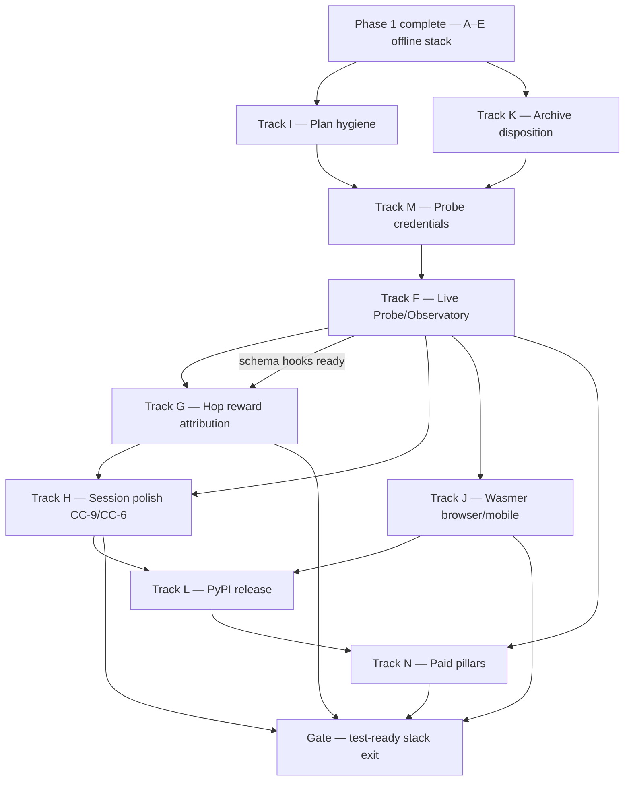

# comPASS Phase 2 — Test-ready stack (Master)

## Purpose

Phase 1 (Tracks A–E) delivered the **offline** testable stack: comPREssOR hop-safety **CC-1..CC-10** on `main` @ `44460ba`, public sibling **soltrinox/comPASS** @ `16e22ec`, Tier 1–4 planes, and Wasmer artifacts with Python fail-open parity.

Phase 2 makes that stack **test-ready for gated live use**: real Probe credentials, terms-safe live Observatory/Probe transports, deeper reward attribution, real Cursor Agent Chat session proofs, Wasmer browser/mobile packaging beyond artifact bytes, plan hygiene, archive disposition, PyPI release plumbing, and paid-pillar spikes that can be acceptance-tested.

This master plan does **not** implement code. It is the Phase 2 program index. Child plans are independent `*.plan.md` files. Execute them in the build order below. Do not collapse tracks into one agent run.

**Ground truth (read first):**

| Item | Value |
|---|---|
| Phase 1 compressor | `soltrinox/comPREssOR` `main` @ `44460ba` (CC-1..CC-10 merged) |
| Phase 1 sibling | public `https://github.com/soltrinox/comPASS` @ `16e22ec` |
| Offline stack | Tier 1–4 + Wasmer artifacts; Python ↔ WASM fail-open parity |
| Canonical compressor path | `/Users/rosario/work/comPREssOR` |
| Sibling path | `/Users/rosario/work/comPASS` |
| Phase 1 plans | `compass_master_orchestration_b029ab33.plan.md` + Tracks A–E |
| Plan index | `/Users/rosario/work/comPASS/PLANS.md` |
| Paid pillars narrative | `/Users/rosario/work/comPASS/docs/gtm/PAID-PILLARS.md` |

**Phase 1 status:** **Complete** for the offline cut. Outstanding user-quoted items are owned by Tracks F–N below — they are concrete todos and acceptance criteria, not backlog vibes.

## Locked defaults

These are not open for re-litigation inside a Phase 2 track unless a named ADR is updated first.

| Default | Value |
|---|---|
| Route failure | **Fail-open** to configured default. Router must never be why a request fails. |
| Probe isolation | Probe **never on the prompt path**. No provider keys in the hook process or browser WASM. |
| Secrets | Keys load only in Probe (and credentialed proxy service). Route / `compass.core` / WASM **never** import secret loaders. |
| Equivalence claim | **Outcome-equivalence** band on oracle-bearing classes. **Never** identical text. |
| Credit assignment | Record enough to re-attribute later. **Do not** claim solved multi-hop credit assignment. |
| Live network | Off by default (`COMPASS_PROBE_ALLOW_NETWORK=0`). Live smoke is env-gated + allowlisted. |
| Provider ToS | Benchmarking / comparative publication denylist enforced before fleet redistribution. |
| Compressor edits | Phase 2 tracks **do not** modify comPREssOR source unless Track H docs-only need is recorded; prefer comPASS + session proofs. |
| Forbidden tree | Never implement against `/Users/rosario/work/CHAT-COMPRESSOR` or restore 0.1.3 identifiers into canonical. |
| Proof | Timestamped `.log.txt` under `test-results/<topic>/`, FULL / PARTIAL / NOT_RUN grades. |

## Have (do not rebuild)

- Offline Probe daemon, Observatory fixtures, Route fail-open, Graph store, Tier 2–4 surfaces under `src/compass/`.
- Wasmer crate + `wasmer/artifacts/*.wasm` + `wasmer/browser/` sandbox pages; mobile still NOT_RUN on device.
- `.env.example` with `COMPASS_PROBE_ALLOW_NETWORK=0` and key placeholders.
- `docs/gtm/PAID-PILLARS.md`, ADRs 0001/0002, `docs/WASMER.md`.
- comPREssOR CC-1..CC-10 on `main` (recipient meta, hop safety, CC-6 counters, CC-9 advisory handoff, bundle, quantization hooks).

## Track table (Phase 2)

| Track | Plan file | isProject | Owns | Exit that unblocks |
|---|---|---|---|---|
| I — Plan hygiene | `compass_track_i_plan_hygiene_9dd2800c.plan.md` | false | Sync A–E + Phase 1 master checkboxes with reality | Honest baseline before claiming Phase 2 progress |
| K — Archive | `compass_track_k_archive_disposition_69873459.plan.md` | false | Delete or keep `CHAT-COMPRESSOR.archived-0.1.3` | Removes wrong-tree footgun |
| M — Credentials | `compass_track_m_probe_credentials_acfb34f5.plan.md` | true | Probe-only secret loaders + docs + import audit | Unblocks live F |
| F — Live Probe/Observatory | `compass_track_f_live_probe_observatory_1ece50e5.plan.md` | true | Gated HTTP transports, ToS denylist, Observations | Live smoke + terms checklist |
| G — Hop reward | `compass_track_g_hop_reward_attribution_10a51057.plan.md` | true | Trajectory / delayed reward join on RouteDecision | Attribution tests green |
| H — Session polish | `compass_track_h_session_polish_cc9_cc6_a9d611b2.plan.md` | true | Real Agent Chat CC-9/CC-6 proofs | Session log under test-results/ |
| J — Wasmer browser/mobile | `compass_track_j_wasmer_browser_mobile_6086a6e5.plan.md` | true | Headless browser smoke + mobile/desktop packaging | NOT_RUN → at least one packaged path |
| L — PyPI release | `compass_track_l_pypi_release_43bd556a.plan.md` | true | Versioning, changelog, TestPyPI dry-run, CI stub | Releasable package story |
| N — Paid pillars | `compass_track_n_paid_pillars_fae9b18d.plan.md` | true | Sync automation, fleet graph stub, governance hooks | Test-ready paid surfaces |

Registered copies of every plan (same bytes):

1. `/Users/rosario/work/.cursor/plans/<filename>`
2. `/Users/rosario/.cursor/plans/<filename>`
3. `/Users/rosario/work/comPASS/.cursor/plans/<filename>`

## Build order

**Recommended execution order (serial preference):**

1. **I ∥ K** — hygiene and archive in parallel (no code dependency).
2. **M** — credentials behind Probe only.
3. **F** — live gated Probe/Observatory.
4. **G** — can start after F schema hooks land (parallel with late F work).
5. **H** — real session polish (needs F advisory path + M keys only if live models used; offline advisory can start earlier).
6. **J** — Wasmer browser/mobile packaging (independent of F after artifacts exist; prefer after F if live browser canary desired).
7. **L** — release versioning after H/J proofs stabilize the package story.
8. **N** — paid pillars after **L + F** (automation + fleet + governance need live probe story and a versioned package).
9. **gate-test-ready-stack-exit**.

## What “test-ready stack” means (exit gate)

All must be true with artifacts under `comPASS/test-results/`:

1. Track I: Phase 1 plan copies agree with merged reality (no stale “PR open”).
2. Track K: archive decision executed or deferred with written README pointer; no 0.1.3 identifiers in canonical.
3. Track M: secret audit green — Route/core/wasm import graph never touches secret loaders.
4. Track F: mocked HTTP suite green; optional live smoke doc + terms checklist committed; Route still fail-open with network denied.
5. Track G: join-correctness tests for delayed reward / trajectory ids.
6. Track H: at least one real Agent Chat session log proving CC-9 advisory + CC-6 cost counters fail-open path.
7. Track J: headless browser smoke CI job; mobile OR documented Wasmer desktop shell beyond raw wasm bytes.
8. Track L: TestPyPI (or documented) dry-run + release workflow stub + changelog.
9. Track N: three paid-pillar surfaces each with acceptance tests linked to `docs/gtm/PAID-PILLARS.md`.

**Non-claim:** test-ready ≠ production fleet, ≠ solved credit assignment, ≠ identical-text multi-model insertion, ≠ unrestricted live benchmarking.

## Agent execution protocol

1. Open **this** Phase 2 master and the child plan. Do not invent Track O without updating this master.
2. Do not modify comPREssOR source unless the child plan explicitly allows docs-only touch (Track H).
3. Update child-plan todo statuses in **all three** registered copies.
4. Do not mark a master track todo `completed` until the child's exit criteria have log evidence.
5. Prefer commit+push plan/docs changes on `soltrinox/comPASS`; never commit `.env` or key material.

## References

- Phase 1 master: `compass_master_orchestration_b029ab33.plan.md`
- Prototype: `/Users/rosario/work/comPASS/PROTOTYPE.md`
- PLANS index: `/Users/rosario/work/comPASS/PLANS.md`
- Paid pillars: `/Users/rosario/work/comPASS/docs/gtm/PAID-PILLARS.md`
