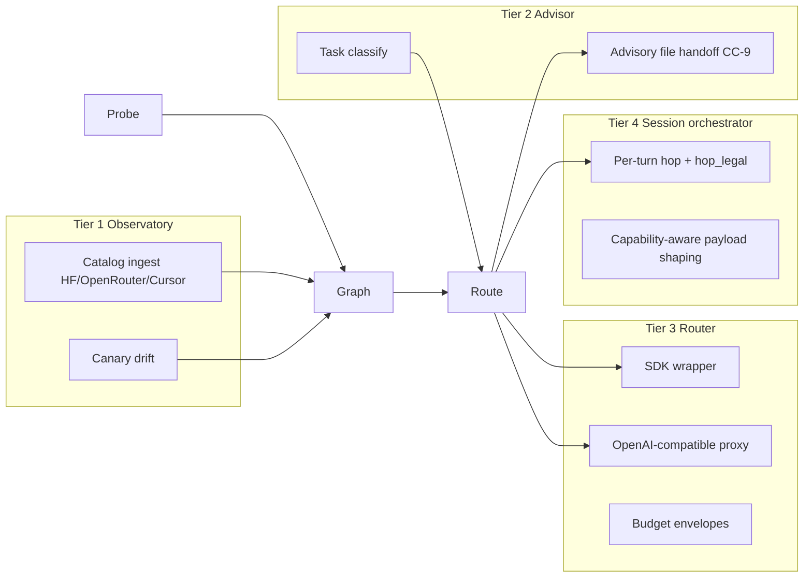

# comPASS Track A — Specs & Docs

## Purpose

Produce the **contracts** every later track implements against. No compressor source edits. No sibling-engine source beyond documentation and schema JSON. After this track, an agent can open a single path under `/Users/rosario/work/comPASS/docs/` and know what to build.

**Ground truth:** `/Users/rosario/work/comPASS/PROTOTYPE.md` (especially §2, §5, §9–§13, §17, Appendix A/B).  
**Summary:** `/Users/rosario/work/comPASS/SUMMARY/2026-09-03-comPASS-prototype-session.md`.  
**Master:** `compass_master_orchestration_b029ab33.plan.md`.

## Deliverable paths (concrete)

Create this tree. Paths are stable; later tracks cite them by absolute path.

```
/Users/rosario/work/comPASS/docs/
  README.md                 # index of this track's deliverables
  CHARTER.md
  ARCHITECTURE.md
  API.md
  STACK.md
  INTEGRATION.md
  RISKS.md
  schema/
    model-graph.v1.json     # human-facing copy under docs/
    statenode-meta.v1.md    # recipient fields spec for CC-1
/Users/rosario/work/comPASS/schema/
  model-graph.v1.json       # machine-facing mirror (identical bytes to docs/schema/)
  bundle.v1.json            # stub or full outline of portable bundle (forward-ref Track B CC-8 / §15)
```

Also keep a short pointer in `/Users/rosario/work/comPASS/.cursor/plans/README.md` (written with this program) linking Track A.

## Locked constraints for every doc in this track

- Product placeholder name: **comPASS**. Sister to **comPREssOR**.
- Three planes: **Probe / Graph / Route**.
- Four tiers: **1 Observatory / 2 Advisor / 3 Router / 4 Session orchestrator**.
- Route **fail-open** to a configured default on any error.
- Probe **never on the prompt path**. Probe holds provider credentials in a separate process.
- Do **not** widen `ctx-graph.v1`. Sibling schema `model-graph.v1.json` only.
- Bitemporal fields on every capability-graph node: `valid_start`, `valid_end`, `status` ∈ `{active, superseded, deprecated}`.
- Scoring: `quality − λ·cost`. Bandits over `(TaskClass, ModelVersion)`.
- Equivalence: outcome band, never identical text.
- Canonical compressor only: `git@github.com:soltrinox/comPREssOR.git` at `/Users/rosario/work/comPREssOR` (0.2.0). Never target `CHAT-COMPRESSOR`.
- No machine-specific absolute paths in any **code** examples that will be copied into the compressor. Docs may cite absolute paths for operator navigation.

---

## 1) `docs/CHARTER.md`

### Required sections

1. **Problem.** Endpoint price spans ~2 orders of magnitude; quality is task-dependent; public leaderboards are contaminated and generic; session state is captive so switching is expensive; orgs lack cost/policy control.
2. **Wedge.** Personal ground truth (probes from the user's own history) + portable memory (compressor forward payload is discrete text). Neither half alone is long-term defensible.
3. **What ships.** Tiers 1–4, each independently shippable, each strictly harder than the last (prototype §2).
4. **Free vs paid boundary.** Free = local engine, full Observatory, local graph, advisory, local routing for owned call sites, local probes on user keys, bundle **format** + manual export/import. Paid = five pillars (cross-machine sync, multi-model insertion, managed graph, enterprise governance, team shared memory). **Never paywall accuracy.**
5. **Non-claims.**
   - Not identical output across models.
   - Not solved cross-hop credit assignment (record for re-attribution).
   - Not a replacement for OpenRouter/LiteLLM (consume them).
   - In-Cursor Agent Chat is advisory only (hook has no model field).
6. **Success metrics (falsifiable).**
   - M0–M4 exit criteria from prototype §17.3 restated as product acceptance.
   - Realized savings vs single-model baseline (Observatory computes this).
   - Hop-turn payload correctness (Track B M1).
   - Advisory fail-open proof (CC-9).
7. **Out of scope for v1.** Exhaustive probing of every endpoint; publishing aggregate leaderboards from private probes; automatic tensor-branch merge on sync conflict.

### Acceptance

File exists, ≥800 words, links to `ARCHITECTURE.md` and `PROTOTYPE.md`, and states the free/paid boundary without ambiguity.

---

## 2) `docs/ARCHITECTURE.md`

### Required content

#### Three planes (hard boundaries)

| Plane | Role | Latency | Credentials | Failure mode |
|---|---|---|---|---|
| **Probe** | Daemon: run probes, record observations, canary drift | Seconds–minutes OK | Holds provider API keys | Isolated process; never blocks prompts |
| **Graph** | Bitemporal capability store + bandit posterior | Read p95 low tens of ms | No provider keys | Stale-read OK; writes from Probe |
| **Route** | Classify → score → decide; only hot-path component | Target p95 < 50 ms | No provider keys | **Fail-open** to configured default |

**Why sibling repo, not a module inside `chat_compressor`:** `hook_cli.py` invariant is "Never requires CURSOR_API_KEY." Probe requires live provider credentials by definition. Therefore Probe cannot share the hook process. That is the concrete technical reason for the sibling repository.

#### Four tiers mapped onto planes



#### Capability curvature

Document the axes from prototype §4 (language, code gen, code comprehension, multi-step planning, agentic tool use, recursion/iteration, long-context fidelity, structured output, multimodal, refusal/safety, latency p50/p95). Model cards = priors; probes = posteriors. Every figure carries `n` and `ci95`.

#### Identity normalization

`(provider, served_id)` identity of a `ModelVersion`. Link to shared `Model` via `version_of` only when behavioral fingerprint agrees. Evidence pools at Model (prior) and measures at ModelVersion (posterior).

### Acceptance

Mermaid present; plane credential boundary stated twice (narrative + table); tiers mapped; no claim that Cursor hooks can enforce model selection.

---

## 3) `docs/schema/model-graph.v1.json` (+ mirror)

### Node kinds (required enum)

Minimum set called out by the program brief, plus the prototype-complete set:

- `Provider`
- `Model`
- `ModelVersion`
- `TaskClass`
- `CapabilityAxis`
- `Probe`
- `Observation`
- `PriceQuote`
- `Policy`
- `RouteDecision`

Brief-mandated core for docs narrative and examples: **`Model`, `TaskClass`, `Probe`, `Observation`, `PriceQuote`, `RouteDecision`**.

### Edge kinds

`serves`, `version_of`, `measures`, `observed_on`, `evidences`, `priced_by`, `supersedes`, `derived_from`, `constrains`, `selected`.

### Bitemporal fields (every node)

```json
{
  "valid_start": {"type": "string", "format": "date-time"},
  "valid_end": {"type": ["string", "null"], "format": "date-time"},
  "status": {"type": "string", "enum": ["active", "superseded", "deprecated"]}
}
```

### Capability figure shape

Never a bare mean:

```json
{
  "mean": 0.81,
  "n": 42,
  "ci95": 0.06
}
```

### Schema identity

Top-level `"schema": "model-graph/v1"`. Do not reuse `ctx-graph/v1`. Include a worked `ModelVersion` example matching prototype §10.3.

### Acceptance

JSON Schema validates the example node. Enum lists are exhaustive in the schema file. Mirror under `/Users/rosario/work/comPASS/schema/model-graph.v1.json` is byte-identical.

---

## 4) `docs/schema/statenode-meta.v1.md` (CC-1 contract)

Specify additive fields on compressor `StateNode.meta` for Track B:

| Field | Type | Required | Notes |
|---|---|---|---|
| `recipient_id` | string | no (absent ⇒ 0.2.0 behavior) | Served model id consuming the forward payload |
| `recipient_version` | string | no | Version / fingerprint when known |
| `route_decision_id` | string | no | URN of `RouteDecision` node when routed by comPASS |
| existing | | | Keep `tool_status`, `tokenizer_id` |

State: additive, backward compatible, round-trip through lineage reload. This doc is the **spec**; Track B owns the code in `handle.py` / `store.py`.

---

## 5) `docs/API.md` — Route plane + advisory

### Route plane API (logical)

```
classify(request, graph_snapshot) -> TaskClass
candidates(task_class, constraints) -> [ModelVersion]
score(model_version, task_class, λ) -> float   # quality − λ·cost
decide(request, envelope, policy) -> RouteDecision | Default
```

**Hard requirements**

- Bounded latency (target p95 < 50 ms for decide path that blocks the caller).
- **Fail-open:** any exception, timeout, empty candidate set, or corrupt graph read → configured default endpoint + logged reason. Never raise into Agent Chat.
- Persist `RouteDecision` (model, task class, scores, λ, constraints applied, rationale, timestamp).
- Confidence gating: overlapping intervals → prefer lower cost; do not pretend certainty.

### Advisory hook contract (CC-9)

- Router service writes a small advisory document under the compressor state root (path TBD in INTEGRATION; e.g. `advisory/latest.json` with `expires_at`, `recommendation`, `rationale`, `task_class`).
- `_compose_additional_context` (compressor) includes it when fresh; ignores when stale, missing, or malformed.
- Cursor hook return shapes unchanged: no model field. Advisory only inside Agent Chat.
- Credential boundary preserved: hook process never loads provider keys.

### Enforcement targets (document clearly)

1. Advisory inside Cursor (Tier 2 only).
2. Cursor SDK wrapper (first real enforcement).
3. OpenAI-compatible local proxy (broadest coverage; owns provider credentials → lives in probe/route service process, never hook path).

### Acceptance

Fail-open stated as a normative MUST. Advisory file schema included. Enforcement vs advisory distinction unmistakable.

---

## 6) `docs/STACK.md` — stack + Wasmer runtime

### Core (matches compressor)

- Python ≥ 3.11
- SQLite (metadata) + JSON (graph documents) + safetensors (tensor payloads)
- NumPy for scoring
- No mandatory heavyweight dependency in the **Route** plane
- Optional dependency groups: `dev`, `hf`, `sdk` (mirror compressor layout)
- Package name until rename: `compass-router`

### Wasmer / WASM boundary (forward-ref Track D)

| In WASM (Route + Graph **read**) | Native sidecar only (Probe) |
|---|---|
| Classify, score, decide, graph snapshot read | Provider credentials |
| Bandit posterior read | Outbound probe HTTP |
| Fail-open default table | Catalog fetch / canary execution |

- Route must stay tens of ms inside WASM.
- Host ABI imports: storage read, clock, config; **no** raw key material into the module.
- Versioning: module ABI semver paired with `model-graph/v1`.
- Link explicitly: "Track D implements this cut; this doc is the contract."

### Acceptance

WASM vs native table present; Python version pinned; optional-deps groups named; no provider keys in browser module stated as a security MUST.

---

## 7) `docs/INTEGRATION.md` — playbook

### Compressor touchpoints (reference only; Track B implements)

Reproduce the §14.3 table with paths relative to `comPREssOR/engine`:

| ID | Files | Change |
|---|---|---|
| CC-1 | `src/chat_compressor/handle.py`, `store.py` | Recipient fields in `StateNode.meta` |
| CC-2 | `handle.py`, `store.py` | Per-recipient inject ledger |
| CC-3 | `pack.py` | Recipient change resets suppression |
| CC-4 | `pack.py`, `handle.py` | Gate `allow_skip` on continuity |
| CC-5 | `pack.py`, `handle.py` | Per-recipient warmup counter |
| CC-6 | new `tokens.py` (+ `metrics.py` call sites) | Pluggable token counter |
| CC-7 | `handle.py` | `hop_legal()` |
| CC-8 | new `bundle.py` | Export/import portable bundle |
| CC-9 | `hook_cli.py` | Fail-open advisory inclusion |
| CC-10 | `store.py` | Optional tensor quantization |

Emphasize: **sanitize — no `/Users/rosario` paths in code.** Canonical 0.2.0 already removed them; do not reintroduce.

### Ingestion sources

- Hugging Face Hub (cards → priors)
- OpenRouter / aggregators (catalog + probe substrate)
- Cursor model list via existing `extract_model_ids` / `resolve_model_ids`

### Classification reuse

`extractive.keyword_set` / `chunks.chunk_text` / `rank.rank_chunks` — do not invent a parallel featurizer in v1.

### Bundle format pointer

Point at prototype §15 `bundle.v1/` layout; full schema fleshed with Track B CC-8.

### Acceptance

Operator can follow the playbook without reading the entire prototype. Absolute paths to canonical repo only in "where to check out," never as hardcoded runtime constants in sample code.

---

## 8) `docs/RISKS.md` — risk register

| ID | Risk | Impact | Mitigation | Owner track |
|---|---|---|---|---|
| R1 | Probe economics (models × classes × reps) dominate savings | Thesis failure | Thompson pruning; canary-only unconditional probes | C |
| R2 | Provider terms restrict benchmarking / comparative publication | Legal / managed-graph scope | Per-provider terms review before probe daemon aimed | E + C |
| R3 | Cross-hop reward attribution unsolved | Tier 4 policy wrong | Persist RouteDecision + recipient lineage; no claim of solved credit | C + B CC-1 |
| R4 | Bundled IDE auto-selection improves | Addressable market narrows | Compete on portability + governance, not generic quality | E |
| R5 | API churn on catalog sources | Maintenance drag | Adapter layer per source; contract tests | C ingest |
| R6 | Implementing against CHAT-COMPRESSOR 0.1.3 | Reintroduce personal paths; wrong version | Hard ban; master decision-working-copy | Master / E |
| R7 | Silent hop bugs (dedup / skip / warmup) | Tier 4 ships broken | Track B M1 scripted hop test | B |
| R8 | Wasmer module receives provider keys | Credential leak in browser | Host ABI deny; Probe native-only | D |
| R9 | Paywalling accuracy | Trust + corpus death | Charter free-tier correctness rule | E |
| R10 | Identical-text marketing claim | False advertising | Equivalence band language only | E |

### Acceptance

≥8 rows; each has owner track; R6/R7/R8 explicit.

---

## 9) Docs folder layout + README

`docs/README.md` lists relative links to every file above and states:

> Track A deliverables. Implementation is Tracks B–D. Product/GTM is Track E. Do not edit compressor source from this track.

### Acceptance checklist for the whole track

- [x] All paths under `/Users/rosario/work/comPASS/docs/` exist
- [x] `schema/model-graph.v1.json` mirrored under `/Users/rosario/work/comPASS/schema/`
- [x] Every doc states fail-open (Route) and never-on-prompt-path (Probe) where relevant
- [x] No compressor `.py` files modified
- [x] Todo statuses updated in all three plan registrations when items complete

## References

- Prototype §9–§13, §17, Appendix A/B
- Master plan track table and build-order mermaid
- comPREssOR `docs/HOOK_CONTRACT.md`, `schema/ctx-graph.v1.json` (do not widen)
