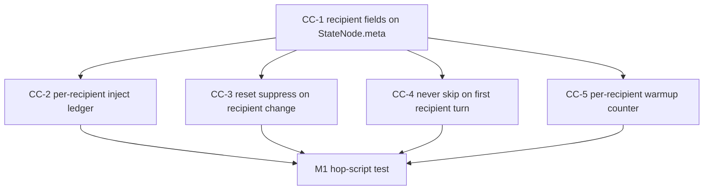

# comPASS Track B — Compressor Prerequisites

## Purpose

Make **model hopping and routing attribution safe** on the canonical compressor before comPASS Tier 4 is allowed to hop.

All changes target:

- Remote: `git@github.com:soltrinox/comPREssOR.git`
- Checkout: `/Users/rosario/work/comPREssOR`
- Engine: **0.2.0**, branch `main`
- Engine package root: `engine/src/chat_compressor/`

**Do not touch** `/Users/rosario/work/CHAT-COMPRESSOR` (untracked working copy at **0.1.3**, pre-sanitization). Implementing there and porting later reintroduces `FORBIDDEN_WORKSPACE = Path("/Users/rosario/work")` and `rosario` identifier regexes that 0.2.0 deliberately removed.

This track does **not** implement comPASS planes. It landed CC-1..CC-10 plus the two milestone tests; PRs #1–#4 are merged on `main` @ `44460ba`.

**Ground truth:** `/Users/rosario/work/comPASS/PROTOTYPE.md` §14 (especially §14.3 table), §15, §17.1, §17.3 M0/M1/M4.  
**Contract from Track A:** `/Users/rosario/work/comPASS/docs/schema/statenode-meta.v1.md` and `/Users/rosario/work/comPASS/docs/INTEGRATION.md` (read if they exist; otherwise use this plan + the prototype).

## Locked defaults

- Additive or env-gated. Absent recipient information, every changed path behaves **exactly as 0.2.0**.
- Fail-open: no change may block Agent Chat on router/advisory failure.
- Do **not** widen `ctx-graph.v1` enums.
- **Sanitize:** no `/Users/rosario/...` absolute paths, no personal identifiers, in source, tests, or fixtures. Guard against project root generically (canonical pattern), never `Path("/Users/rosario/work")`.
- New knobs documented in `engine/env.example` and `docs/HOOK_CONTRACT.md` under managed keys.
- Proof: timestamped `.log.txt` under `test-results/<topic>/`.

## Milestone mapping

| Milestone | CCs | Exit |
|---|---|---|
| **M0** | **CC-1 only** | Recipient identity round-trips through `StateNode.meta` and survives lineage reload; no machine-specific absolute path introduced |
| **M1** | **CC-2, CC-3, CC-4, CC-5** | Scripted session hops recipient at turn 20 → full, unsuppressed, full-budget payload on the hop turn; identical session **without** hop matches 0.2.0 token accounting |
| **M3** (shared with Track C) | **CC-9** | Corrupt/stale/missing advisory does not block Agent Chat |
| **M4** (shared with Track C) | **CC-6, CC-7, CC-8, CC-10** | Accurate cost counts; `hop_legal()`; bundle round-trip; quantization reconstruction within budget |

**Build order inside this track:** M0 → M1 hop-script → PR (can be stacked: M0 PR, then M1 PR, then later CCs). Do not start CC-2 before CC-1: the ledger partition key is `recipient_id`.

## The three silent hop bugs (why M1 exists)

A scan of `engine/src/chat_compressor/` in 0.2.0 confirms **no model or recipient awareness** anywhere. `live_models.py` is A/B arm resolution, not per-turn recipient tracking. These three defects fail **silently** — a hopped session degrades with no error:

1. **Dedup (CC-2 + CC-3).** `sample_for` builds a suppression set via `recent_line_hashes(history, k=3)` from `load_inject_history(self._agent_dir())` — keyed **per session**, not per recipient. `pack_forward` drops lines whose hash is in that set. A newly swapped-in model never saw those lines, so it receives a payload with holes where the system decided the content was already known.
2. **Skip (CC-4).** `pack_forward` returns an empty payload with `method="skip"` when `allow_skip and not openitem_changed and not node_superseded and packed < skip_floor_tokens`. Correct for a model already in the conversation. Catastrophic for a model that just arrived: zero context, no missing-signal.
3. **Warmup (CC-5).** `adaptive_budget(t, novelty_rate)` returns the full budget for `t <= WARMUP_TURNS` (3) then scales down with rolling novelty. A model swapped in at turn 40 receives the turn-40 budget when it needs the turn-1 budget.

**CC-1 is the root-cause fix that makes the other three possible:** `PersistentAgentHandle.step` currently persists `meta={"tool_status": "stub", "tokenizer_id": "hashed-ngram"}`. Nothing records which model produced or consumed a turn. Without recipient identity, hop detection, per-recipient ledger, skip gating, and warmup counters have nothing to key on — and reward attribution across hops is impossible.



---

## File-target map (prototype §14.3 + Appendix C)

All paths relative to `comPREssOR/engine/src/chat_compressor/` unless noted.

| ID | Files | Change | Risk | Acceptance test |
|---|---|---|---|---|
| CC-1 | `handle.py`, `store.py` | Recipient fields in `StateNode.meta` | Low — additive | Lineage round-trip preserves recipient |
| CC-2 | `handle.py`, `store.py` | Per-recipient inject ledger | Medium — changes dedup behavior | New recipient receives unsuppressed payload |
| CC-3 | `pack.py` | Recipient change resets suppression | Low — mirrors supersede path | Hop turn packs full content |
| CC-4 | `pack.py`, `handle.py` | Gate `allow_skip` on continuity | Low | First turn for a recipient never skips |
| CC-5 | `pack.py`, `handle.py` | Per-recipient warmup counter | Low | Late joiner gets full budget |
| CC-6 | **new** `tokens.py`; call sites in `metrics.py` | Pluggable token counter | Medium — touches budgeting | Counts match reference tokenizers |
| CC-7 | `handle.py` | `hop_legal()` predicate | Low — new API | Returns false with pending tool state |
| CC-8 | **new** `bundle.py` | Bundle export/import | Medium | Round-trip equivalence |
| CC-9 | `hook_cli.py` | Fail-open advisory inclusion | Low — must stay fail-open | Missing/stale/corrupt advisory does not block |
| CC-10 | `store.py` | Optional tensor quantization | Medium — numerical | Reconstruction error within budget |

Also update (not new behavior, documentation):

- `engine/env.example` — new knobs
- `docs/HOOK_CONTRACT.md` — managed keys + CC-9
- Tests under `engine/tests/` (or existing test layout) + logs under `test-results/`

---

## CC-1 — State lineage records the recipient (M0)

### Current

`PersistentAgentHandle.step` persists `meta={"tool_status": "stub", "tokenizer_id": "hashed-ngram"}`.

### Change

Add to `StateNode.meta` (additive):

- `recipient_id` (string, optional)
- `recipient_version` (string, optional)
- `route_decision_id` (string, optional; join key to comPASS `RouteDecision`)

Thread these through `handle.py` persist path and `store.py` load/save so lineage reload preserves them.

### Risk

Low. Additive. Old state dirs without the fields must load unchanged.

### Acceptance

1. Unit: write a node with all three fields; reload via `StateStore`; assert equality.
2. Lineage: parent/child chain keeps per-turn recipient.
3. Grep guard: `rg -n '/Users/rosario' engine/` returns no new hits in source (comments/tests included).
4. Log: `test-results/cc-1-recipient-meta/<ts>.log.txt`.

### M0 exit (todo `m0-exit-test`)

M0 is **CC-1 only**. Do not sneak CC-2+ into the M0 commit. Exit language from prototype §17.3: recipient identity round-trips through `StateNode.meta` and survives lineage reload, with test evidence; no machine-specific absolute path introduced.

---

## CC-2 — Dedup suppression assumes a fixed recipient (M1)

### Current

`sample_for` → `recent_line_hashes(history, k=3)` from `load_inject_history(self._agent_dir())` — **session-scoped**.

### Change

Partition the inject ledger by `recipient_id`. `load_inject_history` / save helpers in `store.py` become recipient-aware. Missing `recipient_id` → legacy session-scoped ledger (0.2.0 behavior).

### Risk

Medium. Changes what gets dropped from the forward payload. Must not increase tokens on a no-hop session.

### Acceptance

New recipient on an existing session receives **unsuppressed** payload (lines previously injected for recipient A still appear for recipient B). No-hop regression: token counts within existing tolerance of 0.2.0.

---

## CC-3 — Dedup must reset on recipient change (M1)

### Current

`pack_forward` already clears suppression when `node_superseded` is true:

`if node_superseded or not cross_turn_dedup_enabled(): suppress = set()`

That is the needed precedent.

### Change

Add **recipient change** as a third reset trigger alongside supersession and the env-gate. Detect change by comparing current `recipient_id` to the previous node's `meta.recipient_id`.

### Risk

Low. Mirrors an existing path.

### Acceptance

Hop turn packs full content (suppression set empty). Fixture: two turns recipient A, third turn recipient B, assert B's packed lines include hashes that would have been suppressed for A.

---

## CC-4 — Skip path can send a new model nothing (M1)

### Current

Empty payload `method="skip"` when `allow_skip and not openitem_changed and not node_superseded and packed < skip_floor_tokens`.

### Change

Gate `allow_skip` on **recipient continuity**. Never skip on a recipient's first turn. `handle.py` passes a `recipient_continued: bool` (or equivalent) into `pack_forward`.

### Risk

Low. Slightly fewer skips on hop turns — correct.

### Acceptance

First turn for a recipient **never** returns `method="skip"`, even if open items unchanged and packed < floor. Subsequent turns for the same recipient may still skip.

---

## CC-5 — Adaptive budget starves late-joining models (M1)

### Current

`adaptive_budget(t, novelty_rate)` full budget for `t <= WARMUP_TURNS` (3), then decay. `t` is session turn.

### Change

Compute warmup against a **per-recipient turn counter**, not session `t`. Persist the counter with the ledger or derive it from lineage `recipient_id` sequence.

### Risk

Low. Must not change budget schedule for a single-recipient session.

### Acceptance

Late joiner at turn 40 gets full (turn-1) budget. Single-recipient session budget curve matches 0.2.0.

---

## M1 hop-script test (todo `m1-hop-script-test`)

Write a **scripted** session (no live provider required if packing can be driven offline):

1. 19 turns recipient `model-a`.
2. Turn 20 hop to `model-b`.
3. Assert hop-turn payload is full (not skip), unsuppressed (contains lines hashed on turns 17–19 for A), full-budget (warmup reset).
4. Replay the same 20 turns with `model-a` throughout; token accounting matches a 0.2.0 baseline captured in `test-results/m1-hop-safety/baseline-0.2.0.log.txt`.

This milestone **alone** makes manual model-hopping correct and is independently valuable even if comPASS never ships.

---

## CC-6 — Tokenizer-accurate cost estimation (M4)

### Current

All budgeting flows through `metrics.estimate_tokens` = `max(1, (len(text) + 3) // 4)`. Fine for English GPT-family BPE; drifts on dense code, JSON, non-Latin, and **differently per tokenizer**.

### Change

New module `tokens.py`: pluggable counter resolved per recipient. Keep the cheap estimate for **internal packing**. Use the accurate count for **cost decisions**. Tokenizer identity comes from ingestion (HF `tokenizer_config.json` / `meta.tokenizer_id`). Fallback: current chars/4 estimate.

### Risk

Medium. Touches budgeting. Do not change packing math by default.

### Acceptance

Counts match reference tokenizers on a fixture corpus (at least one HF tokenizer if `[hf]` extra installed; otherwise skip with NOT_RUN and still test the fallback). `estimate_tokens` still used for pack unless an env knob says otherwise.

---

## CC-7 — Hop legality gate (M4 / Tier 4)

### Current

`meta.tool_status = "stub"` — tool state unimplemented. A hop while a tool call is in flight has no defined semantics. Tool-call formats, parallel calls, reasoning blocks differ per provider.

### Change

Expose `hop_legal()` on the handle: **legal only at turn boundaries with no pending tool state.** Router (Track C Tier 4) treats this as a scheduling constraint.

### Risk

Low. New API. Default: if tool state unknown/stub and no pending flag, return True (do not block hops that 0.2.0 would have allowed). When a pending-tool flag exists, return False.

### Acceptance

Returns False with pending tool state; True at a clean turn boundary. Documented in `HOOK_CONTRACT.md` or a short `docs/HOP_LEGAL.md`.

---

## CC-8 — Portable state bundle (M4 / Pillar 1)

### Current

No export/import. Cross-machine migration is paid Pillar 1 and needs a format first (format itself is free).

### Change

New `bundle.py`: `export_bundle()` / `import_bundle()` for:

```
bundle.v1/
  manifest.json        # schema, version, producer id, d, k_max, tokenizer_id,
                       # quantization scheme, lineage head, checksums
  graph.json           # ctx-graph/v1 document
  states/
    t0001.safetensors
    ...
  inject_ledger.json   # per-recipient (CC-2)
  lineage.json         # state_id / parent_id / t + recipient per turn
```

Producer mismatch: importer decides re-project vs graph-only and **reports the mode**. Silent embedding mismatch is the worst outcome.

### Risk

Medium. Round-trip must not drop lineage or ledger partitions.

### Acceptance

Round-trip equivalence test: graph nodes, lineage, ledger, and (if producer matches) `hot_set` / `typed_projection` unchanged on a fixture corpus.

---

## CC-9 — Advisory injection surface (M3 / Tier 2)

### Current

Hook contract: `beforeSubmitPrompt` → `{"continue": true}` + optional `additional_context`. No model field. Fail-open defaults already exist.

### Change

Optional, fail-open, **file-based** handoff. Router writes a small advisory document under the state root. `_compose_additional_context` includes it when fresh; ignores stale / missing / malformed. Hook process still never requires provider keys.

### Risk

Low, **if** fail-open is preserved. A parse exception that raises is a regression.

### Acceptance

Three negative cases must still return the event-safe default: missing file, stale `expires_at`, corrupt JSON. Positive case: fresh file line appears in `additional_context`. Log under `test-results/cc-9-advisory/`.

---

## CC-10 — Quantized tensor index (M4 / Pillar 1)

### Current

`StateStore.save` writes `float32` safetensors (`np.asarray(C, dtype=np.float32)`). **Not** currently quantized. Quantization is new work.

### Change

Optional `int8` or `fp16` with scheme recorded in `meta`. C matrices are L2-normalized (`append_then_pool` → `l2_normalize`), so values are bounded — symmetric per-row scaling is well-conditioned. Default remains float32.

### Risk

Medium, numerical. Must not change local mmap behavior unless opted in.

### Acceptance

Behavioral, not merely numerical: cosine similarity of original vs reconstructed rows above a stated threshold; `hot_set` and `typed_projection` unchanged on a fixture corpus.

---

## Compatibility discipline (every CC)

1. Env knobs with safe defaults (pattern: `CHAT_COMPRESSOR_CROSS_TURN_DEDUP`, `CHAT_COMPRESSOR_INJECT_P1`).
2. Document in `engine/env.example` and `docs/HOOK_CONTRACT.md`.
3. Fail-open non-negotiable.
4. `ctx-graph.v1` enums not widened.
5. **Sanitize check in CI / PR:** no `/Users/rosario`, no `FORBIDDEN_WORKSPACE` absolute home paths, no personal username literals in identifier regexes.
6. Do not modify files outside the engine + docs + tests needed for these CCs.

## PR to main (todo `pr-to-main`) — completed

- **Merged** onto `soltrinox/comPREssOR` `main` @ `44460ba` via PRs **#1–#4** (2026-09-05 PT):
  - #1 CC-1/M0 recipient meta
  - #2 M1 hop safety (CC-2..CC-5)
  - #3 CC-9 advisory handoff
  - #4 CC-6/7/8/10 M4 tokens, hop_legal, bundle, quantization
- Historical stack note: M0 PR then M1 PR then later CCs — executed as above.
- Checklist satisfied: sanitize grep clean; no-hop token accounting; hop-script green; fail-open advisory.

## Out of scope

- comPASS Graph/Probe/Route implementation (Track C).
- Wasmer cut (Track D).
- Product naming / deleting CHAT-COMPRESSOR (master + Track E ADRs). Record a reminder if you find yourself in the 0.1.3 tree; stop.

## References

- Prototype §14.1 three latent defects, §14.2 capability additions, §14.3 table, §14.4 compatibility, §15 bundle, §17.1 repo facts, §17.3 M0/M1/M4
- Appendix C file map
- Track A `INTEGRATION.md` / `statenode-meta.v1.md`
