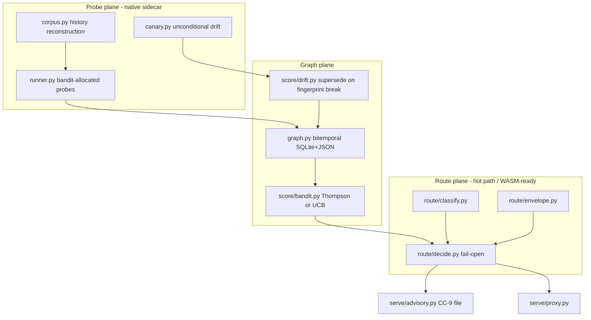

---

name: comPASS Track C — Sibling Engine
overview: Scaffold comPASS repo and implement Graph, Probe, Route planes through Tiers 1–4.
todos:
  - id: scaffold-repo-ci
    content: "Scaffold comPASS repo + CI: pyproject compass-router, src/compass tree, scripts, tests, GitHub Actions matching compressor patterns"
    status: completed
  - id: model-graph-schema-package
    content: "Package model-graph.v1.json + Python loader/validator; bitemporal nodes and supersede; do not widen ctx-graph.v1"
    status: completed
  - id: graph-plane-store-bandit
    content: "Graph plane: SQLite+JSON store, scoring query p95 tens of ms, Thompson/UCB bandit posterior over (TaskClass, ModelVersion)"
    status: completed
  - id: probe-daemon
    content: "Probe daemon: corpus from own history, runner, canary drift; holds keys; never on prompt path"
    status: completed
  - id: route-plane-classify-score
    content: "Route plane: classify via extractive.keyword_set/chunks/rank; score quality−λ·cost; fail-open decide()"
    status: completed
  - id: tier1-observatory
    content: "Tier 1 Observatory: ingest HF + OpenRouter + Cursor; priced versioned catalog; induced fingerprint change supersedes"
    status: completed
  - id: tier2-advisor-cc9
    content: "Tier 2 Advisor + CC-9 handoff: recommendations in session context; corrupt advisory never blocks Agent Chat"
    status: completed
  - id: tier3-sdk-proxy
    content: "Tier 3 SDK wrapper + OpenAI-compatible proxy; budget envelopes; persisted RouteDecision records"
    status: completed
  - id: tier4-orchestrator-hop-legal
    content: "Tier 4 session orchestrator: per-turn hop consulting hop_legal(); capability-aware payload shaping; equivalence-band gate"
    status: completed
isProject: true
---

# comPASS Track C — Sibling Engine

## Purpose

Scaffold the **comPASS** sibling repository and implement the three planes (**Graph, Probe, Route**) through **Tiers 1–4**.

This is the product engine. It **consumes** Track A contracts and Track B hop-safety. It does **not** modify comPREssOR source (Track B owns that). It does **not** put Probe into WASM (Track D).

**Ground truth:** `/Users/rosario/work/comPASS/PROTOTYPE.md` §9–§13, §16, §17.2 tree, §17.3 M2–M4.  
**Contracts:** `/Users/rosario/work/comPASS/docs/` (Track A).  
**Canonical compressor (read-only here):** `/Users/rosario/work/comPREssOR` engine 0.2.0.

**Build-order note from master:** scaffold + Graph + Route core **before** the Track D Wasmer cut; Tiers 1–4 **after** the core is WASM-shaped enough that Observatory/Advisor/Router/Orchestrator do not need a rewrite. Probe stays a native sidecar from day one.

## Locked defaults

- Package: `compass-router`, `requires-python >= 3.11`
- Placeholder product name `comPASS` until master `decision-name` closes — do not create the public remote under a regretted name
- Scoring: `score(m, c) = E[quality(m, c)] − λ · E[cost(m, c)]`
- Allocation: Thompson sampling over `(TaskClass, ModelVersion)` arms; UCB acceptable fallback
- Probe corpus: user's own context-graph history, not public suites
- Classification features: reuse compressor `extractive.keyword_set`, `chunks.chunk_text`, `rank.rank_chunks` (depend on published `chat-compressor` / path the pyproject documents — do not copy-paste a fork of those modules)
- Route **fail-open**; Probe **never on prompt path**
- Credential boundary: provider keys only in Probe (and the proxy process that already owns them). Hook process and browser WASM: none
- Every capability figure: `{mean, n, ci95}`
- Persist every `RouteDecision`
- No aggregate leaderboard published from probe data

## Proposed tree (prototype §17.2)

Create under `/Users/rosario/work/comPASS/` (PROTOTYPE.md and SUMMARY already live at the root):

```
comPASS/
  README.md
  PROTOTYPE.md            # already exists — do not overwrite; link from README
  PLANS.md                # program index (already written by this planning pass)
  pyproject.toml          # name: compass-router, requires-python >=3.11
  schema/
    model-graph.v1.json   # from Track A; this track packages it
    bundle.v1.json
  src/compass/
    __init__.py
    graph.py              # bitemporal capability store
    ingest/
      huggingface.py
      openrouter.py
      cursor.py
    probe/
      corpus.py
      runner.py
      canary.py
    score/
      bandit.py
      reward.py
      drift.py
    route/
      classify.py
      decide.py
      envelope.py
    serve/
      proxy.py
      advisory.py
    bundle.py             # paired with compressor CC-8
  scripts/                # test-*.sh, validate-*.sh (pattern-discovered)
  tests/
  test-results/
  docs/                   # Track A deliverables live here; do not relocate
```

Mirror compressor operational knowledge: optional-deps `dev`, `hf`, `sdk`; pattern-discovered `scripts/test-*.sh`; log-backed proofs under `test-results/<topic>/`.



---

## 1) Scaffold repo + CI

### Deliverables

- `pyproject.toml`: name `compass-router`, python ≥3.11, optional-deps `dev` / `hf` / `sdk`
- Package layout as above; empty modules with docstrings pointing at Track A contracts are OK on the first commit
- `README.md` at repo root: what it is, three planes, four tiers, link to `PROTOTYPE.md` and `docs/`
- CI: lint + unit tests on Python 3.11/3.12; do **not** require live provider keys in default CI
- `.gitignore` covering `.venv`, `test-results/**/*.log.txt` policy (keep proofs, ignore secrets), env files
- Remote gate closed: ADR 0001 Accepted; public remote is `soltrinox/comPASS`. (Historical note: do not invent renames mid-flight.)

### Acceptance

`pip install -e ".[dev]"` works; CI config exists; PROTOTYPE.md still the original spec (not overwritten).

---

## 2) model-graph schema package

Load Track A's `schema/model-graph.v1.json`. Python API:

- `GraphDocument` load/validate/save
- Node kinds: `Provider`, `Model`, `ModelVersion`, `TaskClass`, `CapabilityAxis`, `Probe`, `Observation`, `PriceQuote`, `Policy`, `RouteDecision` (brief core: `Model`, `TaskClass`, `Probe`, `Observation`, `PriceQuote`, `RouteDecision`)
- Bitemporal: `valid_start`, `valid_end`, `status`
- `supersede(old_id) -> new_id` closes the old interval, opens a new node, adds `supersedes` edge — copy the semantics of compressor `CtxGraph.supersede`, **not** the enums
- Queries filter by validity interval so drift never averages across a break

### Acceptance

Invalid node kind raises. Example `ModelVersion` from prototype §10.3 validates. Supersession leaves prior observations attached to the prior version.

---

## 3) Graph plane — store + bandit

### Store

SQLite metadata + JSON documents, mirroring `StateStore`'s two-tier idea (without requiring safetensors in the capability graph). Read path targeted at **low tens of milliseconds** (Route blocks on it). Writes come from Probe, not from Route.

### Bandit

`(TaskClass, ModelVersion)` arms. **Thompson sampling** over the posterior as the default allocator for probe spend. **UCB** allowed as a documented fallback (env or config). Exhaustive "test every endpoint constantly" is the §8 failure mode — pruning is mandatory.

For the **routing** decision, do **not** solve a constrained optimizer per request. Use:

```
score(m, c) = E[quality(m, c)] − λ · E[cost(m, c)]
```

Tune λ in a slow outer loop until realized spend meets the target rate. Confidence gating: overlapping `ci95` → do not prefer; cost is the tiebreak.

### Reward module (`score/reward.py`)

Three sources, documented honestly:

1. Verifiable outcomes (tests pass, schema validates) — strongest
2. Implicit compressor signals (`OpenItem` stays open, `Fact` superseded soon) — unique, noisy, weak prior only
3. Model-as-judge — last resort, always record judge identity

**Do not claim solved credit assignment across hops.** Persist enough (`RouteDecision` + CC-1 recipient lineage) to re-attribute later.

### Acceptance

- Read benchmark on a fixture graph: p95 tens of ms locally
- Thompson allocates near-zero spend to a cell established as poor
- Scoring function unit-tested; λ documented

---

## 4) Probe daemon

Separate process. Holds provider credentials. **Never imported by `route/` or by compressor `hook_cli.py`.**

### Corpus (`probe/corpus.py`)

Draw from the user's context graphs: `Fact` with `kind_hint` in `{decision, design, outcome}`, `OpenItem` state, `Event` outcomes. Reconstruct a task from a real historical episode with a known outcome. That is task-distribution match + contamination immunity.

### Runner (`probe/runner.py`)

Execute bandit-chosen probes. n > 1 per cell (nondeterminism). Record `Observation` nodes with provenance.

### Canary (`probe/canary.py`)

Small fixed canary set against every active `ModelVersion` on a schedule. **Not** bandit-pruned (drift detection cannot be pruned without defeating itself). Fingerprint shift beyond threshold → `supersede` the `ModelVersion`.

### Terms

Before pointing the daemon at a provider, check terms (Track E R2). Config must allow denylisting providers.

### Acceptance

- Process boundary test: route-plane import graph does not import `compass.probe.runner`
- Canary-induced fingerprint change supersedes rather than overwriting a score (this is also M2 exit)
- No credentials in repo; env-file pattern matching compressor (and never written to the managed hook env)

---

## 5) Route plane — classify + score

### Classify (`route/classify.py`)

Map incoming request → `TaskClass` **before** the answer is known, from the prompt + current graph state alone. Features reuse `extractive.keyword_set` / `chunks.chunk_text` / `rank.rank_chunks`. Seed clusters with capability axes from prototype §4.

Misclassification cost is asymmetric: hard task → weak model wastes a turn + human recovery; reverse wastes cents. Bias toward **over-provisioning**. Mid-turn escalation (Tier 3/4) is the recovery path, and only on oracle-bearing classes.

### Decide (`route/decide.py`)

1. Classify
2. Filter by policy, data classification, context-window, availability
3. Score survivors `quality − λ·cost`
4. Confidence gate
5. Envelope check (raise λ as spend approaches limit)
6. Persist `RouteDecision`
7. Return choice + machine-readable rationale

**Fail-open:** any error → configured default. Copy compressor hook discipline: catch broadly, log, return the safe default.

### Acceptance

- Fail-open unit tests: thrown exception, timeout, empty graph, corrupt JSON → default
- Classification does not call the network
- Decide path has no provider keys in memory

---

## 6) Tier 1 — Observatory (M2)

Ingest at least **two** sources from `{huggingface, openrouter, cursor}`. Cursor reuse: `extract_model_ids` / `resolve_model_ids` semantics (do not hardcode personal workspace paths).

Identity: `(provider, served_id)` = `ModelVersion`. Cards = priors (`card_source` provenance); observations override cards, never the reverse.

### M2 exit (prototype §17.3)

Catalog populated with priced, versioned entries; an induced fingerprint change triggers **supersession rather than score overwrite**.

---

## 7) Tier 2 — Advisor + CC-9 handoff (M3)

Write `serve/advisory.py` producing the file Track B CC-9 consumes. Recommendation shape:

> this resembles `<TaskClass>`; across your last N tasks of this class, model X scored 0.82 at $0.11/task and model Y scored 0.85 at $0.94/task.

This is the only tier expressible inside Cursor Agent Chat (no model field on the hook). Documentation must not call it enforcement.

Depends on Track B CC-9 landing in the compressor. If CC-9 is not merged, ship the writer + contract tests against a mock `_compose_additional_context`.

### M3 exit

Recommendations appear in session context; a corrupt or stale advisory file **provably** does not block Agent Chat. Log evidence under `test-results/m3-advisor/`.

---

## 8) Tier 3 — SDK + proxy (M4 start)

### SDK wrapper

First **real** enforcement: anything constructing a Cursor/OpenAI client with an explicit model parameter can be routed.

### OpenAI-compatible proxy (`serve/proxy.py`)

Local chat-completions endpoint: classify, select, forward. Owns provider credentials → **same process isolation family as Probe**, never the hook path.

### Envelopes (`route/envelope.py`)

Session / project / org scope, period + limit. Raise λ as consumption approaches the limit (gradual degradation, not a hard stop). Enforcement (not reporting) is paid Pillar 4; the **mechanism** is built here so free local envelopes still work for a single user.

### M4 (router half) exit

Enforced routing with persisted `RouteDecision` records.

---

## 9) Tier 4 — Session orchestrator + `hop_legal`

Per-turn routing inside one continuous session. This is the differentiated capability. Requires Track B M1 (hop safety) and CC-7 (`hop_legal()`).

### Behavior

- Consult `hop_legal()`: refuse hop with pending tool state
- Capability-aware payload shaping: vary `hot_set` quota shares (open-item / decision / path-heading) per recipient curvature (prototype §16)
- Equivalence-band gate: decline to hop inside a task class whose band is too wide
- Escalation ladder only on oracle-bearing classes
- Credit assignment: record, do not "solve"

### M4 (orchestrator / bundle half)

Paired with Track B CC-8/CC-10: bundle round-trips across two machines with `hot_set` and `typed_projection` unchanged. If a second machine is unavailable, document PARTIAL and test import on a second temp producer-matched directory.

### Acceptance

Hop is skipped when `hop_legal()` is false; rationale persisted. No identical-text claim in logs or UI strings.

---

## Milestone summary (this track)

| Milestone | Track C work | Also needs | Exit |
|---|---|---|---|
| M2 | Schema + ingest + canary/drift | Track A schema | Priced versioned catalog; fingerprint change supersedes |
| M3 | Classify + bandit + advisory writer | Track B CC-9 | Recs in context; corrupt advisory fail-open |
| M4 | SDK/proxy/envelopes + orchestrator | Track B CC-7/8/10, M1 hops | RouteDecision persistence; bundle round-trip |

## Explicit non-goals

- Do not rebuild LiteLLM / OpenRouter
- Do not widen `ctx-graph.v1`
- Do not run Probe inside the hook or inside WASM
- Do not target `/Users/rosario/work/CHAT-COMPRESSOR`
- Do not hardcode `/Users/rosario` in source

## Proof

Each milestone: `test-results/<m2|m3|m4>/` timestamped logs, proof report, re-run instructions, FULL/PARTIAL/NOT_RUN grades. Capability numbers always carry `n` and `ci95`.

## References

- Prototype §9 planes, §10 schema, §11 ingest, §12 probing/scoring, §13 routing, §16 equivalence, §17.2 tree, §17.3 M2–M4
- Track A `ARCHITECTURE.md`, `API.md`, `schema/model-graph.v1.json`
- Track B M1 + CC-7/8/9/10
- Track D consumes the Route+Graph read split you leave behind
