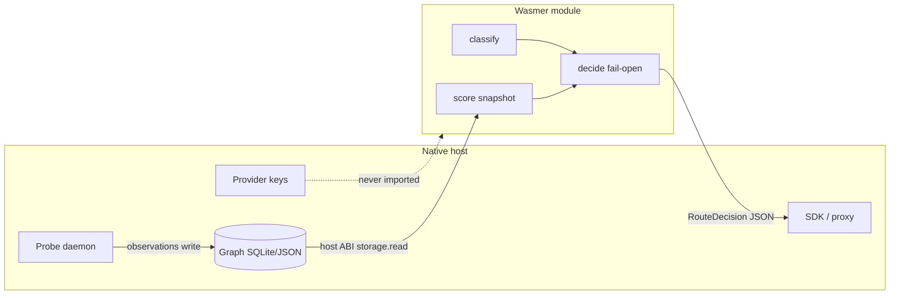

# comPASS Track D — Wasmer Deployment

## Purpose

Cut the **Route plane + Graph read path** so they run under **Wasmer** (WASM): browser sandbox and desktop/mobile **build-once-run-anywhere**. **Probe remains a native sidecar.** Route must stay in the **tens of milliseconds**.

This track implements the runtime contract in Track A `docs/STACK.md`. It does not invent new routing math (Track C) and does not modify comPREssOR (Track B).

**Ground truth:** `/Users/rosario/work/comPASS/PROTOTYPE.md` §9 (plane boundaries), §13 (fail-open), Track A `STACK.md` / `ARCHITECTURE.md`.  
**Depends on:** Track C scaffold with a WASM-friendly core split (or this track performs that split if C left a Python-only monolith).

## Why this cut exists

| Requirement | Implication |
|---|---|
| Route p95 target < 50 ms | WASM module must be small: classify + score + snapshot read + decide. No HTTP, no HF client, no tokenizer downloads |
| Probe holds provider keys and does network | **Cannot** enter the browser sandbox or the WASM module |
| Fail-open | WASM and native must default identically when the graph is missing, corrupt, or slow |
| Build once, run anywhere | Wasmer targets: browser, desktop, mobile — same module bytes + host ABI |
| Credential boundary | No provider keys, no `CURSOR_API_KEY`, no OpenRouter key inside the module or its memory |



## Locked defaults

- **In WASM:** `route.classify`, `route.decide` (pure), Graph **read** of a snapshot, bandit posterior **read**, fail-open default table, `RouteDecision` struct serialization.
- **Native only:** Probe runner/canary, catalog fetch, HF/OpenRouter clients, proxy that holds keys, bundle sync, any write that needs credentials.
- Host ABI versioned (semver). Breaking ABI = bump; pair with `model-graph/v1`.
- No `/Users/rosario` paths in module or glue.
- Link every runtime choice back to `/Users/rosario/work/comPASS/docs/STACK.md` (create `docs/WASMER.md` if STACK would become unreadable).

---

## 1) WASM-friendly core crate/module split

### Target layout (adapt if Track C already split)

```
src/compass/
  core/                 # WASM-safe
    classify.py or .rs
    score_read.py
    decide.py
    snapshot.py         # immutable graph view
    defaults.py         # fail-open table
  native/               # excluded from WASM build
    probe/
    ingest/
    serve/proxy.py
```

Language choice (record in STACK.md / WASMER.md):

- **Preferred if feasible:** compile the hot path to WASM from a small Rust crate *or* a tightly bounded Python subset compiled via an existing Wasmer/py2wasm path the repo actually supports. Do not pretend a full CPython+NumPy stack is "the browser module."
- **Acceptable v1:** a dedicated `compass-core` crate (Rust) implementing classify-lite + score-from-snapshot + decide, with Python bindings for native and `cdylib` for Wasmer. Snapshot is a pre-serialized JSON/flatbuffer produced natively.
- **Not acceptable:** shipping provider SDKs, `httpx`, or env files into the `.wasm`.

### Rules for core code

- No filesystem except through host imports
- No env lookup of `*_API_KEY`
- No unbounded allocations on the decide path
- Pure functions where possible: `decide(snapshot, request, config) -> Decision | Default`

### Acceptance

A `wasm32` (or Wasmer-native) build of **core only** succeeds. `native/` modules are not in the wasm object. Size budget recorded (set a number in WASMER.md after the first build; track regressions).

---

## 2) Host ABI (storage / fetch / key boundaries)

Define a documented import table. Example (normative names may change but the **boundaries** may not):

| Import | Direction | Allowed | Forbidden |
|---|---|---|---|
| `storage.read_snapshot(agent_or_project_id) -> bytes` | host → module | Graph snapshot, default table, λ, envelopes **without secrets** | Provider keys, raw transcripts that policy forbids in-browser |
| `clock.now_iso()` | host → module | Timestamps for validity filtering | — |
| `log.write(level, msg)` | module → host | Rationale, errors | Key material, full prompt if policy says no |
| `fetch` | **optional, native hosts only** | Not in browser module | Browser build: import **absent** |
| `keys.*` | — | **Does not exist** | Never add |

### Key boundary (security MUST)

- Browser module: **zero** provider keys, **zero** Cursor keys.
- Desktop/mobile module: same. Keys stay in the native sidecar / OS keychain / env of the Probe/proxy process.
- Snapshot producer (native) strips secrets before `storage.read_snapshot`.
- Code review checklist item in the runbook: `rg` for `KEY`, `token`, `secret` in the core crate.

### Versioning

- `COMPASS_HOST_ABI = 1.x`
- Module advertises `abi_min` / `abi_max`
- Host refuses to instantiate an incompatible module (fail-open to default endpoint, log reason)

### Acceptance

ABI md/spec exists; browser build has no `fetch` import; a test that attempts to pass a key into module memory fails the suite (the test is the guard).

---

## 3) Browser sandbox package

Package a page or extension surface that:

1. Instantiates the Wasmer/WASM module
2. Feeds a **pre-built snapshot** (from the native sidecar or a user-imported JSON graph)
3. Calls `decide` on each request the UI owns
4. Fail-open if instantiate/decide throws
5. Renders the **advisory** rationale (Tier 2). Enforcement in-browser is only for call sites the page owns (e.g. a web playground), never Cursor Agent Chat

Probe in the browser: **not in WASM**. If probing happens at all on a desktop browser install, it is the native/extension sidecar.

### Acceptance

Manual + automated: module loads without network; corrupt snapshot → default; no key appears in wasm memory dump / import list.

---

## 4) Desktop / mobile Wasmer packaging

**Build-once-run-anywhere** for the **same** Route+Graph module:

- Desktop: Wasmer CLI or embedded Wasmer runtime next to the native Probe sidecar
- Mobile: Wasmer-supported target as documented (if a target is NOT_RUN, say so — do not fake a TestFlight)

Pairing protocol: sidecar writes snapshot file or SHM; module reads via host ABI; sidecar receives `RouteDecision` JSON and performs the actual HTTP to the provider (native).

### Acceptance

One module artifact hashed in CI; at least **two** hosts run it (e.g. macOS native Wasmer + linux CI). Mobile may be PARTIAL with a documented gap.

---

## 5) Deploy runbook

Write `/Users/rosario/work/comPASS/docs/WASMER.md` (and add a short section to `STACK.md` linking it):

- Artifact names and ABI version
- How to pair Probe sidecar
- Browser CSP notes (no eval of host secrets)
- Fail-open behavior
- Rollback: pin previous module hash
- What is **not** in the module (keys, probe, ingest)
- Sanitization: no machine-specific paths

### Acceptance

An engineer who has not read this plan can follow WASMER.md to run the browser sandbox and a native Wasmer decide() on a fixture snapshot.

---

## 6) CI matrix

| Job | Target | Must pass |
|---|---|---|
| `core-native` | linux + macos Python/Rust native | unit decide/classify |
| `core-wasm` | wasm32 / Wasmer | instantiate + decide fixture |
| `fail-open-parity` | native vs wasm | identical defaulting |
| `browser-sandbox` | headless | load + no fetch import |
| `mobile` | as available | FULL or explicit NOT_RUN |

No live provider keys in CI.

---

## 7) Fail-open parity tests

Table-driven cases run on **both** native core and WASM core:

| Case | Expected |
|---|---|
| Missing snapshot | configured default + reason `snapshot_missing` |
| Truncated/corrupt JSON | default + `snapshot_corrupt` |
| Decide timeout / trap | default + `module_trap` |
| Empty candidate set | default + `no_candidates` |
| Valid snapshot, overlapping CIs | lower cost, not a fake winner |
| Valid snapshot, clear winner | selected id matches native |

Same `RouteDecision.rationale` codes. Divergence is a release blocker.

### Acceptance

CI job `fail-open-parity` green; logs under `test-results/wasmer-parity/`.

---

## Performance budget

- Decide p95 **tens of ms** on a snapshot with hundreds of ModelVersion nodes (state the fixture size in the proof).
- If WASM is slower than native but still < 50 ms p95, document the gap; do not silently regress past 50 ms.

## Out of scope

- Putting Probe, ingest, or proxy-with-keys into WASM
- Changing CC-* compressor code
- Claiming identical model outputs
- Hardcoding `/Users/rosario` into WASI preopens — use relative/workspace roots supplied by the host

## References

- Track A `STACK.md`, `ARCHITECTURE.md`, `API.md`
- Prototype §9.1–§9.3 plane boundaries, §13.1 enforcement targets
- Track C core modules this cut consumes
