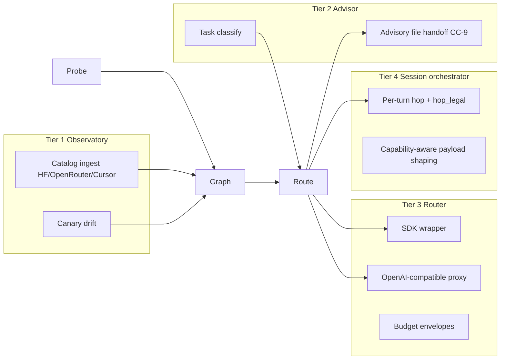

# comPASS Architecture

**Product:** comPASS (sister to comPREssOR)  
**Ground truth:** [`../PROTOTYPE.md`](../PROTOTYPE.md) §9–§13  
**Charter:** [`CHARTER.md`](CHARTER.md)

One engine, **three planes** separated by latency, credential, and failure boundaries. Four **tiers** map onto those planes. Cursor Agent Chat hooks **cannot** enforce model selection — advisory only.

---

## 1. Three planes (hard boundaries)

| Plane | Role | Latency | Credentials | Failure mode |
|---|---|---|---|---|
| **Probe** | Daemon: run probes, record observations, canary drift | Seconds–minutes OK | Holds provider API keys | Isolated process; **never blocks prompts**; **NEVER on the prompt path** |
| **Graph** | Bitemporal capability store + bandit posterior | Read p95 low tens of ms | **No** provider keys | Stale-read OK; writes from Probe |
| **Route** | Classify → score → decide; only hot-path component | Target p95 **< 50 ms** | **No** provider keys | **Fail-open** to configured default |

### Credential boundary (stated twice)

**Narrative.** The compressor `hook_cli.py` invariant is *"Never requires CURSOR_API_KEY."* Probe requires live provider credentials by definition. Therefore Probe **cannot** share the hook process. That is the concrete technical reason comPASS is a **sibling repository**, not a module inside `chat_compressor`. Provider keys stay in the Probe (native) process. Route and Graph never hold them. Browser WASM (Track D) must never receive raw key material.

**Table.** See the Credentials column above: Probe holds keys; Graph and Route do not. Route failure is fail-open; Probe failure must not block prompts.

---

## 2. Four tiers mapped onto planes



| Tier | Name | Primary planes | Enforcement |
|---|---|---|---|
| 1 | Observatory | Probe + Graph | None (catalog + drift) |
| 2 | Advisor | Graph + Route (advise path) | Advisory only — Cursor hooks have **no model field** |
| 3 | Router | Route + Graph read; proxy owns keys in service process | SDK wrapper; OpenAI-compatible proxy |
| 4 | Session orchestrator | Route + compressor hop path | Per-turn hop gated by `hop_legal()` |

---

## 3. Capability curvature

Model capability is a **vector**, not a scalar (prototype §4). Axes measured separately because they dissociate in practice:

- Language generation
- Code generation
- Code comprehension and localization
- Multi-step planning
- Agentic tool use
- Recursion / iteration (build-test-fix to convergence)
- Long-context fidelity
- Structured output fidelity
- Multimodal input / image generation
- Refusal and safety posture
- Latency profile (p50 and p95 separately)

**Model cards = priors** (cheap, self-reported, never conclusions). **Probes = posteriors** (user task classes). Every capability figure carries `n` and `ci95` — never a bare mean. The router must distinguish "measured mediocre" from "barely measured."

Scoring for the decision:

```
score(m, c) = E[quality(m, c)] − λ · E[cost(m, c)]
```

Bandit allocation of probe spend: Thompson sampling (UCB allowed) over `(TaskClass, ModelVersion)` arms.

---

## 4. Identity normalization

- Identity of a **`ModelVersion`:** `(provider, served_id)`.
- Link versions to a shared **`Model`** via `version_of` **only when** a behavioral fingerprint (canary set) agrees.
- Evidence **pools** at `Model` (prior) and **measures** at `ModelVersion` (posterior).
- On fingerprint shift: **supersede** the `ModelVersion` (close `valid_end`, set `status` to `superseded`) and open a new validity interval — never overwrite scores across a break.

Bitemporal fields on every capability-graph node: `valid_start`, `valid_end`, `status` ∈ `{active, superseded, deprecated}`.

Schema: sibling **`model-graph.v1.json`** only. Do **not** widen `ctx-graph.v1`.

Node kinds (core narrative set): `Model`, `TaskClass`, `Probe`, `Observation`, `PriceQuote`, `RouteDecision` (full enum in schema includes Provider, ModelVersion, CapabilityAxis, Policy).

---

## 5. Route hot path (summary)

1. `classify(request, graph_snapshot) → TaskClass`
2. Filter candidates by policy, data class, context window, availability
3. `score = quality − λ·cost`; confidence gating — overlapping intervals prefer lower cost
4. Consult budget envelope; raise λ near limit
5. Persist `RouteDecision`; return choice + rationale
6. On **any** error, timeout, empty candidates, or corrupt graph read → **fail-open** to configured default + logged reason

In-IDE Cursor Agent Chat: **advisory only** (no model field in hooks). Real enforcement is SDK wrapper and local proxy (credentials in probe/route **service** process, never hook path).

Wasmer cut (Track D contract in [`STACK.md`](STACK.md)): Route + Graph **READ** path only; Probe native sidecar; **no provider keys in browser WASM**.

---

## 6. Equivalence and compressor coupling

- Equivalence claim: **outcome-equivalence band**, never identical text.
- Canonical compressor: `soltrinox/comPREssOR` @ **0.2.0**. Never implement against `CHAT-COMPRESSOR`.
- No machine-specific absolute paths in any **code** examples that would land in the compressor.

See [`INTEGRATION.md`](INTEGRATION.md) for CC-1–CC-10 touchpoints (Track B owns code).
