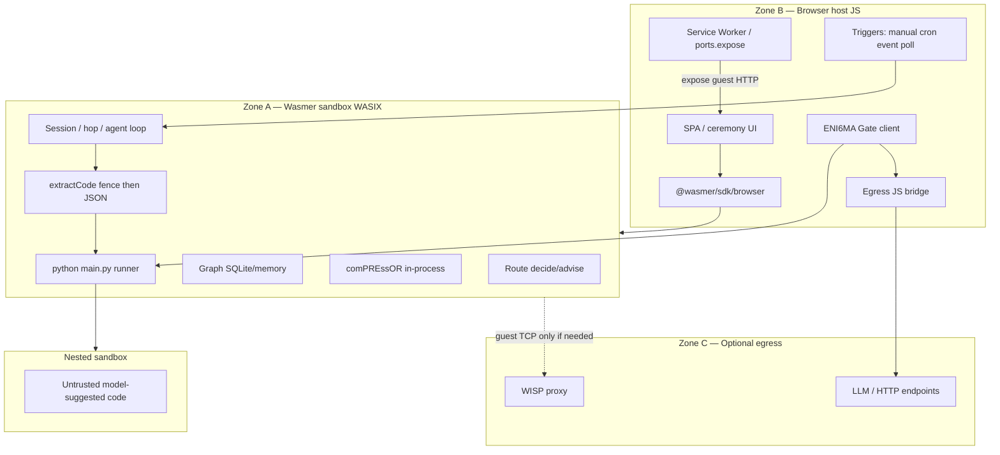

# comPASS Architecture

**Product:** comPASS (sister to comPREssOR)  
**Package:** `compass-router`  
**Runtime (Phase 3):** sovereign **browser-only** Wasmer agent, ENI6MA-gated  
**Ground truth (historical product brief):** [`../PROTOTYPE.md`](../PROTOTYPE.md) §9–§13  
**Charter:** [`CHARTER.md`](CHARTER.md)  
**Decision:** [`adr/0005-eni6ma-gated-browser-agent.md`](adr/0005-eni6ma-gated-browser-agent.md) (Accepted 2026-09-06)

One tab = one appliance. Full lifecycle & systems stack map: [`WASMER-DEPLOYMENT.md`](WASMER-DEPLOYMENT.md). Product logic runs inside an in-page Wasmer (WASIX) sandbox. Policies and world-changing acts require an ENI6MA circuit ceremony. Cursor / IDE integration is **not** a product surface.

> **Supersedes (product runtime):** Track D “Route+Graph WASM read-only + Probe native sidecar,” Wasmer Edge FastAPI+Postgres as primary deploy, and Cursor Agent Chat advisory hooks as an enforcement path. Those remain historical Phase 1–2 notes in [`STACK.md`](STACK.md) / [`WASMER.md`](WASMER.md).

---

## 1. Zones



| Zone | What | Owns product logic? |
|---|---|---|
| **A — Wasmer sandbox** | Pinned `python/python`, compass + comPREssOR, guest FS | **Yes** |
| **B — Browser host** | Shell, COOP/COEP, SDK, ceremony UX, triggers, egress bridge, `ports.expose` | Glue only |
| **C — Outside browser** | WISP and/or provider HTTP | Egress only — not our control plane |

---

## 2. Three planes (remapped for browser)

Latency / credential / failure boundaries still hold; **process layout does not**.

| Plane | Role (Phase 3) | Credentials | Failure |
|---|---|---|---|
| **Route** | Classify → score → decide inside sandbox | **No** provider keys | **Fail-open** to configured default |
| **Graph** | Bitemporal capability store + bandit on **guest SQLite / memory** | **No** provider keys | Stale-read OK |
| **Probe** | Offline fixtures by default; live catalog/provider calls only via **Gate + JS bridge** | Short-lived tokens injected at ceremony — **never** ambient keys in the static bundle | Must not block the agent loop; fail soft to fixtures |

**comPREssOR** is an in-process Python library in the same sandbox (not a sidecar).  
**Session / hop orchestrator** lives in-sandbox and replaces any Cursor hook path.

### Credential rule (stated twice)

1. Static page and guest image never ship long-lived provider secrets.  
2. Live egress is Gate-checked and mediated by the host JS bridge (preferred) or optional WISP for raw guest TCP.

---

## 3. ENI6MA authority (hard rule)

**Policies and agent rules mutate only through the cryptographic interface.**

1. **Foundry** mints twin-circuit binaries (prover / verifier).  
2. Resolve circuit: **local cache first**; else cloud/GitHub URL; recompute **SHA-256** (+ byte length). Mismatch → **fail closed**. Digest is the trust root — not the CDN host. Never trust a client-supplied digest without a pinned authority.  
3. User/agent requests a **challenge** → returns a **proof** against that exact binary.  
4. **Control** burns the nonce **before** validate (no replay).  
5. **Gate** wraps every world-changing act: `policy.update`, `agent.schedule`, `run_python`, LLM call, tool/egress — bind → burn → validate.

Start triggers (below) may **run** an agent only under an **already ceremony-bound** policy. Start ≠ authorize a policy change.

---

## 4. Triggers

| Trigger | Mechanism (Zone B) |
|---|---|
| Manual | Run control in the page |
| Cron | In-tab scheduler / Service Worker alarm within policy windows |
| Event | Payload into exposed guest HTTP (`ports.expose`) |
| Poll | Status/payload watch via JS bridge when net is allowed |

All share one Gate-checked policy blob installed by ceremony.

---

## 5. LLM → extract → Wasmer loop

1. Agent requests an LLM call → **Gate** → host **JS bridge** (deny-by-default).  
2. On reply, extract Python:  
   - **First:** markdown fences (`python` / `py` / bare ``` if body looks like Python); close only on matching fence; never exec an open fence.  
   - **Fallback** if empty/unusable: `tool_calls` / `run_python({code})` / JSON `{ "code": "..." }`.  
3. Gate `run_python` (code hash in envelope) → write `main.py` on guest FS → `python /workspace/main.py` → capture stdout/stderr → Observation back into the loop.  
4. Prefer file write over `python -c`. Nested sandbox when policy demands stronger isolation.  
5. Host page must be cross-origin isolated (`COOP`/`COEP`, `window.crossOriginIsolated === true`).

---

## 6. Persistence

| Store | Phase 3 verdict |
|---|---|
| Guest SQLite / files on WASIX FS | **Primary** Graph + bandit + sessions |
| In-memory Python | Demos only (lost on refresh) |
| IndexedDB / OPFS ↔ `sandbox.fs` | Optional durable bridge across reloads |
| Wasmer Edge managed Postgres | **Out of scope** for product runtime until Postgres-in-browser exists |

Schema remains `model-graph/v1` (sibling to compressor `ctx-graph`; do not widen compressor schema).

---

## 7. Networking / egress

| Path | How |
|---|---|
| UI ↔ agent API | Guest HTTP listener + `sandbox.ports.expose` |
| Agent ↔ providers / poll targets | **JS bridge** (preferred), Gate + policy allowlist |
| Guest raw TCP | Optional `network: { mode: 'wisp', url: 'wss://…' }` |
| No bridge / no WISP | Offline / mocked Probe only |

---

## 8. Air-gap and page recall

At recall (or first hydrate then cache), deliver:

- App shell (SRI)  
- `@wasmer/sdk` + workers  
- Pinned `python/python@=…`  
- compass / comPREssOR guest packages  
- Twin-circuit binaries  
- Artifact **manifest** per file: `{ sha256, byteLength, source }`

After first successful hydrate, OPFS/IndexedDB cache supports offline. Sovereign mode: local LLM + local Control ledger.

---

## 9. Capability curvature & Route hot path

Unchanged product science (prototype §4):

- Capability is a **vector** (language, code gen, planning, tools, long-context, structured output, multimodal, safety, latency p50/p95, …).  
- Model cards = priors; probes = posteriors; every figure carries `n` and `ci95`.  
- `score(m, c) = E[quality] − λ · E[cost]`; Thompson/UCB over `(TaskClass, ModelVersion)`.  
- Identity: `ModelVersion = (provider, served_id)`; bitemporal supersede on fingerprint break.  
- Route steps: classify → filter → score → budget → persist `RouteDecision` → fail-open on any error.

Enforcement is the **in-tab agent + Gate**, not IDE hooks.

---

## 10. Generic LLM adapter

Single OpenAI-compatible ingress (`POST /v1/chat/completions`). Modes: **decide** (weighted Graph), **catalog pin**, **proxy override** (explicit host/IP/port). comPREssOR supplies hop-safe forward injection when the target model changes. Normative API: [`API.md`](API.md) §6 · [`adr/0006-generic-llm-adapter.md`](adr/0006-generic-llm-adapter.md).

---

## 11. Equivalence and compressor coupling

- Outcome-equivalence band, never identical text.  
- Canonical compressor: `soltrinox/comPREssOR` (hop-safe CC-1..CC-10). Never implement against archived `CHAT-COMPRESSOR`.  
- See [`INTEGRATION.md`](INTEGRATION.md).

---

## 12. Explicit non-goals

- Cursor plugin / IDE advisory as primary product path  
- Native Probe / proxy / comPREssOR **sidecars** as default deploy  
- Wasmer Edge app + managed Postgres as the agent control plane  
- Long-lived multi-tenant server (each tab = one instance)  
- Trusting client-supplied digests without pin authority  

---

## 13. Related docs

| Doc | Role |
|---|---|
| [`adr/0005-eni6ma-gated-browser-agent.md`](adr/0005-eni6ma-gated-browser-agent.md) | Accepted deploy + authority decision |
| [`adr/0006-generic-llm-adapter.md`](adr/0006-generic-llm-adapter.md) | Accepted generic LLM adapter modes |
| [`API.md`](API.md) | Route + adapter §6 |
| [`WASMER.md`](WASMER.md) | Artifacts, ABI, Phase 3 browser notes |
| [`WASMER-DEPLOYMENT.md`](WASMER-DEPLOYMENT.md) | Full deploy lifecycle, zone A–D stack map, Gate + agy-bridge, ports, cheat sheet |
| [`STACK.md`](STACK.md) | Language/deps; historical process layout marked superseded |
| [`API.md`](API.md) | Route/Graph API shapes |
| [`CHARTER.md`](CHARTER.md) | Problem, wedge, free vs paid |
