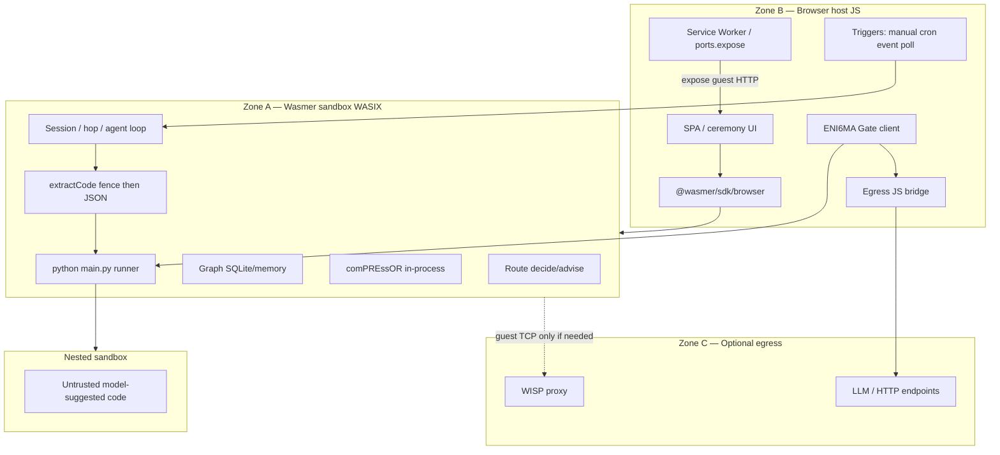

# comPASS Framework (canonical)

**Status:** Canonical. This document is the single source of truth for what comPASS *is* and *how it runs today*.
**Date:** 2026-09-07 (PT)
**Product:** comPASS — sibling engine to comPREssOR
**Python package:** `compass-router` (`requires-python >= 3.11`)
**Runtime:** browser-only Wasmer appliance, ENI6MA-gated — one tab = one agent
**Voice:** exposition — mechanism, observable outcome, scope boundary. Unmeasured claims are marked.

This document is assembled from [`CHARTER.md`](CHARTER.md), [`ARCHITECTURE.md`](ARCHITECTURE.md), [`STACK.md`](STACK.md), [`AUDIT-GOALS-VS-BROWSER-STACK.md`](AUDIT-GOALS-VS-BROWSER-STACK.md), and ADR 0001–0007. Where those documents disagree, the ADR decision wins and is stated here as **current**, not as a delta the reader has to apply. Every supersession is recorded in [Appendix B](#appendix-b--supersession-ledger).

[`../PROTOTYPE.md`](../PROTOTYPE.md) is the **origin brief** (2026-09-03) and remains the provenance record. It is not the current architecture.

---

## 0. Decisions in force (ADR 0001–0007)

All seven ADRs are **Accepted**. Their decisions are the current state of the product, restated here in the present tense.

| ADR | Decision in force today |
|---|---|
| [0001](adr/0001-product-name.md) | Product name is **comPASS**; Python package is **`compass-router`**; artifact prefix follows the package name. Public remote authorized (2026-09-05). |
| [0002](adr/0002-working-copy-disposition.md) | The **only** compressor implementation target is the canonical `comPREssOR` checkout (engine **0.2.0**, `main`). Agents **refuse** edits to the sibling `CHAT-COMPRESSOR` working copy. 0.1.3 personal identifiers and machine-specific absolute paths are **never** merged forward. |
| [0003](adr/0003-archive-disposition.md) | The archived `*.archived-0.1.3` compressor tree is **kept** with a loud README. Agents **refuse** all edits under it. |
| [0004](adr/0004-reward-attribution.md) | `RouteDecision` carries additive join fields (`trajectory_id`, `hop_index`, `episode_id`). Delayed rewards join post-hoc by bitemporal **supersede**, never by mutating `decide()`. Records always carry `credit_assignment_solved: false`. Bandit update from attribution is gated behind `COMPASS_ATTRIBUTION_BANDIT_UPDATE` (default off). |
| [0005](adr/0005-eni6ma-gated-browser-agent.md) | The product runtime is a **browser-only Wasmer agent** (zone A) with host JS as glue (zone B). Policies and world-changing acts pass an **ENI6MA ceremony**. Egress is a deny-by-default JS bridge. **There is no Cursor/IDE product path**, no native-sidecar default deploy, and no Wasmer Edge + managed Postgres control plane. |
| [0006](adr/0006-generic-llm-adapter.md) | One OpenAI-compatible ingress (`POST /v1/chat/completions`) with a `compass` extension object. Selection priority: **proxy override → catalog pin → decide**. `selection_mode` is persisted on `RouteDecision`. The adapter — not an IDE hook — is the primary enforcement target. |
| [0007](adr/0007-agy-behind-eni6ma-gate.md) | The local `agy-bridge` runs the ENI6MA circuit Gate **before** spawning `agy`: digest-pinned circuit load, HTTP 403 and no spawn on digest mismatch. |

---

## 1. Problem and wedge

Endpoint price spans roughly **two orders of magnitude** per token, and quality does not track price monotonically per task. A mid-tier model often matches a frontier model on constrained code edits, structured extraction, and short summarization, and fails badly at multi-step planning or long-context synthesis. The optimal choice is a function of **task type**, not a global ranking — yet almost every user makes one global choice and lives with it.

The cost of mismatch is asymmetric. Overpaying on an easy task produces a slightly larger invoice. Under-provisioning a hard task wastes a turn, propagates a wrong assumption, and burns human recovery time. The second cost dominates and is never measured.

Public leaderboards are weak inputs to a routing decision: their task mix is not the user's task mix, their contents leak into training corpora so scores drift upward independently of capability, and they report a scalar where the decision needs a **vector**. What a routing decision requires is a **posterior over the user's own task distribution**, produced by measuring endpoints against work drawn from the user's history.

Endpoint behavior also changes underneath a stable identifier (quantization, serving stack, safety layer, silent version rolls). Any scoring system that treats a model id as a stable entity averages observations across a behavior break. Detecting the break and partitioning evidence is a hard requirement.

**Wedge:** personal ground truth (probes from the user's own history) **plus** portable memory. The comPREssOR forward channel is unconditionally discrete text (`SampledPayload(kind="text", ...)`), so session state is a bounded, model-agnostic digest. Switching models mid-session costs the **forward budget** (default 1024 tokens via `CHAT_COMPRESSOR_FORWARD_BUDGET`), not transcript length. That is the structural reason comPASS is a sibling of comPREssOR rather than a standalone router.

Flywheel: more sessions → more graph → better-calibrated routing → better outcomes per dollar → more reason to keep the compressor running.

---

## 2. What ships — tiers 1–4

Four capability tiers, each independently shippable, each strictly harder than the last.

| Tier | Name | What it does | Current surface (ADR 0005/0006) |
|---|---|---|---|
| **1** | **Observatory** | Live catalog: endpoints, price, latency p50/p95, context window, rate limits, availability, licence/data posture; canary drift on fixed ids. Useful with no routing. | In-tab agent; offline fixtures by default, live catalog only through Gate + JS bridge |
| **2** | **Advisor** | Task classification plus a surfaced (not enforced) recommendation with measured scores and cost. | In-tab agent UI. **Not** Cursor Agent Chat — see below |
| **3** | **Router** | Real enforcement at owned call sites: budget envelopes, policy constraints, escalation ladders. | The generic LLM adapter (ADR 0006) and the SDK wrapper / local proxy for library users |
| **4** | **Session orchestrator** | Per-turn routing inside one continuous session (hop + `hop_legal`, capability-aware payload shaping). Requires compressor CC-1–CC-10. | In-sandbox session/hop orchestrator |

**Tier 2 correction (current).** The origin brief presented "advisory, inside Cursor" as Tier 2's primary enforcement target, on the mechanical grounds that Cursor hook return shapes carry no model field. That mechanical fact is still true, and it is still true that a hook surface can only advise. What changed is the product decision: ADR 0005 removes the IDE from the product path entirely, so Tier 2's surface is the in-tab agent. The CC-9 advisory file handoff remains a real, tested library capability and a compressor-side integration seam — it is not a shipping product surface.

Scoring: `score(m, c) = E[quality(m, c)] − λ · E[cost(m, c)]`. Bandits (Thompson / UCB) over `(TaskClass, ModelVersion)` arms.

---

## 3. Three planes

The plane separation is a **latency, credential, and failure boundary**, and it is current. The Phase 1–2 *process layout* that once implemented it (Probe daemon sidecar + IDE hook + local proxy) is **historical** — see [Appendix A](#appendix-a--historical-phase-12-process-layout).

| Plane | Role today | Credentials | Failure mode |
|---|---|---|---|
| **Route** | Classify → filter → score → budget → persist `RouteDecision`, inside the sandbox | **No** provider keys | **Fail-open** to configured default on any error |
| **Graph** | Bitemporal capability store + bandit posterior on guest SQLite / memory | **No** provider keys | Stale read is acceptable |
| **Probe** | Offline fixtures by default; live catalog and provider calls only via Gate + JS bridge | Short-lived tokens injected at ceremony — **never** ambient keys in the static bundle | Must not block the agent loop; fails soft to fixtures |

**comPREssOR** runs as an in-process Python library in the same sandbox, not as a sidecar. The session / hop orchestrator lives in-sandbox.

**Credential rule, stated twice.** (1) The static page and the guest image never ship long-lived provider secrets. (2) Live egress is Gate-checked and mediated by the host JS bridge, or optionally by WISP when the guest needs raw TCP.

---

## 4. Runtime architecture — browser appliance

One tab is one appliance. Product logic runs inside an in-page Wasmer (WASIX) sandbox. Full lifecycle and stack map: [`WASMER-DEPLOYMENT.md`](WASMER-DEPLOYMENT.md).



| Zone | What | Owns product logic? |
|---|---|---|
| **A — Wasmer sandbox** | Pinned `python/python`, compass + comPREssOR, guest FS | **Yes** |
| **B — Browser host** | Shell, COOP/COEP, SDK, ceremony UX, triggers, egress bridge, `ports.expose` | Glue only |
| **C — Outside browser** | WISP and/or provider HTTP | Egress only — not our control plane |

### 4.1 ENI6MA authority (hard rule)

Policies and agent rules mutate **only** through the cryptographic interface.

1. **Foundry** mints twin-circuit binaries (prover / verifier).
2. Resolve the circuit **local cache first**, else cloud/GitHub URL; recompute **SHA-256** plus byte length. Mismatch → **fail closed**. The digest is the trust root, not the CDN host. A client-supplied digest is never trusted without a pinned authority.
3. The user or agent requests a **challenge**, which returns a **proof** against that exact binary.
4. **Control** burns the nonce **before** validate, so a proof cannot be replayed.
5. **Gate** wraps every world-changing act: `policy.update`, `agent.schedule`, `run_python`, LLM call, tool or egress — bind → burn → validate.

Start triggers may **run** an agent only under an already ceremony-bound policy. Start is not authorization to change a policy.

### 4.2 Triggers

| Trigger | Mechanism (zone B) |
|---|---|
| Manual | Run control in the page |
| Cron | In-tab scheduler / Service Worker alarm within policy windows |
| Event | Payload into exposed guest HTTP (`ports.expose`) |
| Poll | Status/payload watch via JS bridge when net is allowed |

All four share one Gate-checked policy blob installed by ceremony.

### 4.3 LLM → extract → execute loop

1. The agent requests an LLM call → **Gate** → host **JS bridge** (deny-by-default).
2. On reply, extract Python: **first** markdown fences (`python` / `py` / bare fence when the body looks like Python), closing only on a matching fence and never executing an open fence; **fallback** when empty or unusable to `tool_calls` / `run_python({code})` / JSON `{ "code": "..." }`.
3. Gate `run_python` with the code hash in the envelope → write `main.py` on the guest FS → `python /workspace/main.py` → capture stdout/stderr → feed the observation back into the loop.
4. Prefer a file write over `python -c`. Use a nested sandbox when policy demands stronger isolation.
5. The host page must be cross-origin isolated (`COOP` / `COEP`, `window.crossOriginIsolated === true`).

### 4.4 Persistence

| Store | Verdict |
|---|---|
| Guest SQLite / files on WASIX FS | **Primary** Graph + bandit + sessions |
| In-memory Python | Demos only (lost on refresh) |
| IndexedDB / OPFS ↔ `sandbox.fs` | Optional durable bridge across reloads |
| Wasmer Edge managed Postgres | **Out of scope** for the product runtime until Postgres-in-browser exists |

### 4.5 Egress

| Path | How |
|---|---|
| UI ↔ agent API | Guest HTTP listener + `sandbox.ports.expose` |
| Agent ↔ providers / poll targets | **JS bridge** (preferred), Gate + policy allowlist |
| Guest raw TCP | Optional `network: { mode: 'wisp', url: 'wss://…' }` |
| No bridge, no WISP | Offline / mocked Probe only |

### 4.6 Air-gap and page recall

At recall (or first hydrate then cache) the page delivers: app shell with SRI, `@wasmer/sdk` plus workers, pinned `python/python@=…`, compass and comPREssOR guest packages, twin-circuit binaries, and an artifact **manifest** carrying `{ sha256, byteLength, source }` per file. After a first successful hydrate, the OPFS/IndexedDB cache supports offline operation. Sovereign mode is a local LLM plus a local Control ledger.

---

## 5. Generic LLM adapter (ADR 0006)

A single OpenAI-compatible ingress, `POST /v1/chat/completions`, carrying a `compass` extension object. Normative contract: [`API.md`](API.md) §6.

| Mode | Trigger | Behavior |
|---|---|---|
| **proxy override** | Explicit host / IP / port / path in the request | Forward to that endpoint; deny-by-default allowlist applies in the browser |
| **catalog pin** | A linked catalog model is named | Route to that pinned `ModelVersion` |
| **decide** | Neither of the above | Weighted Graph selection |

Priority is **proxy override → catalog pin → decide**. `selection_mode ∈ {decide, catalog, proxy_override}` is persisted on the `RouteDecision`. comPREssOR supplies hop-safe forward injection whenever the target model changes; shared KV across models is never assumed. The `compass` extension is stripped before forwarding upstream.

---

## 6. Local `agy` bridge behind the Gate (ADR 0007)

The loopback OpenAI-shaped `agy-bridge` spawns the Google Antigravity CLI with no provider keys in-process. Because any local process could otherwise drive it, the bridge runs the Gate first:

1. Ingress reads `body.compass.circuit` (top-level `circuit` also accepted).
2. Circuits cache under `COMPASS_CIRCUIT_CACHE` (default `~/.compass/circuits/`), named by SHA-256 hex, with `url-index.json` mapping URL → digest.
3. On cache miss, fetch over HTTPS from `raw.githubusercontent.com` or `github.com` only; blob URLs normalize to raw; an optional `url + .sha256` sidecar is honored.
4. Recompute SHA-256. Sidecar or client pin mismatch → **HTTP 403, `agy` is never spawned**.
5. Validate by `WebAssembly.compile`/`instantiate` plus the `eni6maValidate` seam. A missing proof is allowed only in dev (`AGY_GATE_DEV=1` or `AGY_FAIL_OPEN`) as mode `digest_only`.
6. Responses report `compass.gate { cached, sha256, source, validated, mode }`. No circuit means pass-through as mode `no_circuit` unless `AGY_GATE_REQUIRED=1`.

The real ENI6MA ABI replaces the `eni6maValidate` stub without changing this HTTP contract.

---

## 7. Capability science and the Route hot path

Unchanged product science:

- Capability is a **vector**: language, code generation, planning, tool use, long context, structured output, multimodal, safety, latency p50/p95, and so on.
- Model cards are priors; probes are posteriors. **Every capability figure carries `n` and `ci95`.**
- `score(m, c) = E[quality] − λ · E[cost]`; Thompson / UCB over `(TaskClass, ModelVersion)`.
- Identity is `ModelVersion = (provider, served_id)`, with bitemporal **supersede** on a fingerprint break rather than a score overwrite.
- Route steps: classify → filter by hard constraints → score → check budget envelope → persist `RouteDecision` → **fail-open on any error**.
- Escalation ladders apply only to task classes that have a reliable failure oracle. Applying one to an unverifiable task ships bad output silently.
- Budget envelopes attach at session, project, and organization scope; the Route plane raises λ as consumption approaches the limit so degradation is gradual.

Enforcement is the in-tab agent plus Gate, and the adapter for library callers. It is not an IDE hook.

---

## 8. Schema surface — one canonical file

The capability graph is `model-graph/v1`. It is a **sibling** of the compressor's `ctx-graph/v1`; widening the compressor enums is forbidden, because their node kinds and relations are fixed by both JSON Schema `enum` and a runtime `ValueError`.

| Path | Role |
|---|---|
| [`../src/compass/schema/model-graph.v1.json`](../src/compass/schema/model-graph.v1.json) | **CANONICAL.** Read at runtime by `compass.schema.loader` and the only copy that ships in the sdist and wheel (`[tool.setuptools.package-data]`). |
| [`../schema/model-graph.v1.json`](../schema/model-graph.v1.json) | Generated mirror — machine-facing repo copy |
| [`schema/model-graph.v1.json`](schema/model-graph.v1.json) | Generated mirror — docs copy |

Mirrors are regenerated, never hand-edited:

```bash
python scripts/sync_schema.py          # rewrite both mirrors from canonical
python scripts/sync_schema.py --check  # non-zero exit on drift; no writes
```

`tests/test_schema.py` fails when the three SHA-256 digests diverge, so drift cannot reach `main` silently.

Bitemporal contract: `valid_start`, `valid_end`, `status ∈ {active, superseded, deprecated}`. Node kinds: `Provider`, `Model`, `ModelVersion`, `TaskClass`, `CapabilityAxis`, `Probe`, `Observation`, `PriceQuote`, `Policy`, `RouteDecision`. Edge kinds: `serves`, `version_of`, `measures`, `observed_on`, `evidences`, `priced_by`, `supersedes`, `derived_from`, `constrains`, `selected`.

---

## 9. Stack and artifacts

| Layer | Choice |
|---|---|
| Language | **Python ≥ 3.11** |
| Metadata store | **SQLite** |
| Graph documents | **JSON** (`model-graph/v1`) |
| Tensor payloads | **safetensors** |
| Scoring math | **NumPy** |
| Route plane deps | No mandatory heavyweight dependency |

Optional dependency groups mirror the compressor layout: `dev` (tests, lint, typecheck), `hf` (Hugging Face ingestion), `sdk` (client wrappers for owned call sites). The Probe plane may take additional dependencies because it is not latency-bound and is never on the prompt path.

**Wasmer artifacts** (build-once, digest-pinned; details in [`WASMER.md`](WASMER.md)):

| Artifact | Target |
|---|---|
| `wasmer/artifacts/compass_core_bg.wasm` | Browser sandbox cdylib — size budget **≤ 150000 bytes** |
| `wasmer/artifacts/compass-decide.wasm` | Desktop Wasmer CLI (WASI) |
| Same `compass_core_bg.wasm` bytes | Mobile hosts when one exists — currently **NOT_RUN** |

Host ABI: `COMPASS_HOST_ABI = 1.0.0`; module `ABI_MIN=1.0.0` / `ABI_MAX=1.999.0`; contract in [`abi/host-abi.v1.md`](abi/host-abi.v1.md). Browser exports are `compass_alloc`, `compass_free`, `compass_decide_json`, `compass_last_len`, `memory` — and **no `fetch` import**. WASM artifacts are not a wheel extra; the published sdist and wheel are pure Python.

Fail-open reason codes are identical on the native core and in WASM: `snapshot_missing`, `snapshot_corrupt`, `module_trap`, `no_candidates`, `abi_incompatible`. Proof: `python scripts/wasmer_parity.py`.

---

## 10. Locked invariants

- **Planes:** Probe (credentials, **never on the prompt path**) / Graph (bitemporal + bandit) / Route (hot path, **fail-open**).
- **Tiers:** 1 Observatory, 2 Advisor, 3 Router, 4 Session orchestrator.
- **Scoring:** `quality − λ·cost`; Thompson / UCB over `(TaskClass, ModelVersion)`.
- **Bitemporal:** `valid_start`, `valid_end`, `status ∈ {active, superseded, deprecated}`; behavior breaks supersede, they do not overwrite.
- **Equivalence:** **outcome-equivalence band**, never identical text.
- **Runtime:** browser-only Wasmer agent plus ENI6MA Gate ([ADR 0005](adr/0005-eni6ma-gated-browser-agent.md)); **no Cursor/IDE product path**.
- **Authority:** digest is the trust root; fail closed on mismatch; burn the nonce before validate.
- **Egress:** host JS bridge deny-by-default; optional WISP; **no ambient provider keys in the static page**.
- **Schema:** one canonical `model-graph.v1.json` under `src/compass/schema/`; mirrors generated; never widen `ctx-graph.v1`.
- **Compressor:** canonical `comPREssOR` engine **0.2.0** only; refuse edits to the `CHAT-COMPRESSOR` working copy or any `*.archived-0.1.3` tree.
- **Sanitization:** no machine-specific absolute paths — no hardcoded user home directories — in package source, docs content, module glue, or WASI preopens. Hosts supply workspace-relative roots.
- **Evidence:** honest `NOT_RUN` over fake green; every capability figure carries `n` and `ci95`.

---

## 11. Free versus paid

The free tier must be genuinely useful and must **never withhold correctness**. Accuracy is never paywalled.

**Free (local engine, open source):** full Observatory for reachable endpoints; local task classification and local capability graph; advisory recommendations; local routing for owned call sites (SDK wrapper plus local proxy); local probes on the user's own keys and budget; the full portable-state-bundle **format** plus manual export/import; single machine, single user, local persistence.

**Paid — five pillars:**

1. **Cross-machine sync** of compressed session state (graph + quantized tensor index + lineage), encrypted end to end.
2. **Multi-model insertion** — carried context plus a bare prompt yields an **outcome-equivalence band** across substituted endpoints, never identical text.
3. **Managed capability graph** — aggregated, anonymized, opt-in fleet probe data.
4. **Enterprise governance** — enforced budget envelopes, policy routing, audit, residency, SSO/RBAC.
5. **Team shared memory** — project-scoped shared context graphs (depends on pillar 1).

Individual pricing is positioned against **realized savings versus a single-model baseline**, which the Observatory computes. Enterprise is per-seat with governance and support.

---

## 12. Non-claims and non-goals

**Non-claims** (so docs and marketing cannot overstate):

1. **Not identical output across models.** Equivalence is an outcome-equivalence band on oracle-bearing task classes.
2. **Not solved cross-hop credit assignment.** Lineage is persisted for later re-attribution; `credit_assignment_solved` is always recorded `false`.
3. **Not a replacement for OpenRouter / LiteLLM.** Those are consumed as catalog and execution substrate.
4. **No IDE enforcement, and no IDE product path.** Hook return shapes have no model field, and ADR 0005 removed the IDE surface from the product.
5. Aggregate leaderboards are never published from private probes.

**Non-goals:**

- Cursor plugin / IDE advisory as a product path.
- Native Probe / proxy / comPREssOR **sidecars** as the default deploy.
- Wasmer Edge app plus managed Postgres as the agent control plane.
- Long-lived multi-tenant server — each tab is one instance.
- Trusting a client-supplied digest without a pin authority.
- Exhaustive probing of every endpoint (bandit pruning is mandatory).
- Automatic tensor-branch merge on sync conflict — the first release presents divergence as a user choice.
- Implementing against the archived compressor 0.1.3 line.
- Widening `ctx-graph.v1`.

---

## 13. Success metrics (falsifiable)

| Milestone | Exit criterion |
|---|---|
| **M0** | Recipient identity round-trips through `StateNode.meta` and survives lineage reload; no machine-specific absolute paths introduced in compressor code. |
| **M1** | A scripted hop at turn 20 delivers a full, unsuppressed, full-budget payload; a no-hop session matches 0.2.0 token accounting. |
| **M2** | Catalog populated with priced, versioned entries; an induced fingerprint change triggers supersession, not a score overwrite. |
| **M3** | Recommendations appear in session context; a corrupt, stale, or missing advisory **provably does not block** the consuming session (fail-open). |
| **M4** | Enforced routing with a persisted `RouteDecision`; a bundle round-trips across two machines with unchanged `hot_set` / `typed_projection` on fixtures. |

Additional product metrics: realized savings versus a single-model baseline, hop-turn payload correctness, and an advisory fail-open proof.

---

## 14. Current status

Graded from [`AUDIT-GOALS-VS-BROWSER-STACK.md`](AUDIT-GOALS-VS-BROWSER-STACK.md) §B (2026-09-07). **Done** = shipped and testable · **Partial** = library or lab only · **Not done** = designed or blocked.

| Goal | Status | Notes |
|---|---|---|
| Task-type routing | **Done (lib)** | Route decide + tests |
| Personal posterior / probes | **Partial** | Offline fixtures; live Probe **NOT_RUN** (no keys) |
| Bitemporal supersede | **Done** | Graph store + offline Observatory |
| Portable hop memory (comPREssOR) | **Done (sibling)** | CC-1–CC-10 on comPREssOR; browser always-on inject partial |
| Free-tier correctness | **Done (policy)** | Free/paid docs + spikes |
| T1 Observatory | **Partial** | Offline catalog yes; live smoke no |
| T2 Advisor | **Done → surface changed** | CC-9 exists; IDE path dropped per ADR 0005 |
| T3 Router / adapter | **Done (engine)** | Track O adapter + proxy; browser UX thin |
| T4 Session hops | **Partial** | Orchestrator + hop legality in the library; full in-tab loop incomplete |
| ENI6MA ceremony UX (six-color) | **Not done** | No interactive UI |
| Digest-pinned circuit load | **Done** | `circuitLoader` + bridge Gate |
| Cryptographic verify / burn ledger | **Not done** | Prove-only; Gate is digest + ABI probe |
| Fence → Wasmer exec product loop | **Not done** | Designed, not Gate-wrapped as product |
| `agy-bridge` + Docker | **Done (lab)** | `:8791` healthy; default `fake-agy` |
| Live Gemini via `agy` | **Partial** | Needs live-agy profile + host auth |
| Air-gap deny egress | **Done (testable)** | Empty allowlist / dry-run |
| Paid pillars | **Spike / test-ready** | Not production SaaS |
| Mobile Wasmer host | **NOT_RUN** | Documentation only |

**Bottom line.** Against the original charter (tiers 1–4 offline) the libraries and tests are mostly there; live Probe, production publish, and mobile remain open. Against the Phase 3 browser sovereign agent, the scaffold and the Gate digest path are roughly half built; the interactive ceremony, real verify/burn, and full agent boot are **not ready to ship**. What is testable today is the Docker bridge, the digest/proof smoke, and the adapter/proxy dry-run — a lab, not a production agent.

---

## 15. Document map

| Doc | Role | Normative for |
|---|---|---|
| **`FRAMEWORK.md`** (this file) | **Canonical** — what comPASS is and how it runs | Ground truth; conflict resolution |
| [`adr/`](adr/) 0001–0007 | Accepted decisions | Anything this document summarizes; the ADR text wins on detail |
| [`API.md`](API.md) | Route API, advisory contract, adapter §6 | Client wire contracts |
| [`ARCHITECTURE.md`](ARCHITECTURE.md) | Zone-level runtime detail | Zone diagrams, extract→exec loop |
| [`WASMER-DEPLOYMENT.md`](WASMER-DEPLOYMENT.md) | Deploy lifecycle, zones A–D, ports, operator cheat sheet | Operations |
| [`WASMER.md`](WASMER.md) | Artifacts, ABI, size budget, parity codes | Artifact facts |
| [`CHARTER.md`](CHARTER.md) | Problem, wedge, tiers, free vs paid, non-claims | Product framing |
| [`STACK.md`](STACK.md) | Language and dependency contract | Library stack; **its §2 process layout is historical** |
| [`AUDIT-GOALS-VS-BROWSER-STACK.md`](AUDIT-GOALS-VS-BROWSER-STACK.md) | Goal → status map | Status claims |
| [`INTEGRATION.md`](INTEGRATION.md) | Compressor CC-1–CC-10 touchpoints | Compressor seams |
| [`RISKS.md`](RISKS.md) | Risk register R1–R12 | Risk language |
| [`RELEASE.md`](RELEASE.md) | Version scheme, tags, publish | Release process |
| [`../PROTOTYPE.md`](../PROTOTYPE.md) | **Historical** origin brief (2026-09-03) | Provenance only |

---

## Appendix A — Historical Phase 1–2 process layout

Retained because Phase 1–2 CI, the offline `compass-router` library, and the existing test suite were built against it. **It is not the shipping appliance topology** (ADR 0005).

```
[ IDE hook / Agent Chat ]     --fail-open advisory file-->  (no keys)
[ SDK wrapper / local proxy ] --decide--> Route --read--> Graph
[ Probe daemon ]              --write observations--> Graph
         ^ holds provider credentials (native only)
```

- **Route** — hot path; fail-open to configured default; target p95 < 50 ms.
- **Graph** — bitemporal store + bandit posterior; read path shared with Route.
- **Probe** — native sidecar / daemon; holds credentials; outbound HTTP; catalog fetch; canary execution.

The Track D WASM cut that accompanied it (Route + Graph **read** in WASM, Probe native-only) is likewise historical as a *deploy story*. Its **security requirements survive unchanged and are still enforced**: no provider keys in the WASM module; host ABI imports limited to storage read, clock, config, and log; `keys.*` and unrestricted outbound HTTP forbidden; browser builds omit `fetch`; module ABI semver paired with `model-graph/v1`.

Logical persistence layout for library users (paths operator-configurable):

```
compass-data/
  graph/
    model-graph.json          # model-graph/v1 document(s)
  meta.sqlite                 # indexes, envelopes, bandit state pointers
  tensors/                    # optional safetensors
  advisory/                   # CC-9 handoff (service side)
    latest.json
```

---

## Appendix B — Supersession ledger

Every conflict this document resolves, and the authority that resolves it.

| # | Prior statement | Where it appears | Current state | Authority |
|---|---|---|---|---|
| 1 | `PROTOTYPE.md` is ground truth | `PLANS.md`, `docs/README.md`, `CHARTER.md`, root `README.md` | **This document** is ground truth; the origin brief is provenance | This document; ADR 0005 |
| 2 | Advisory inside an IDE is Tier 2's primary enforcement target | Origin brief §13.1 | Tier 2's surface is the in-tab agent; the adapter is the enforcement target. CC-9 remains a library seam | ADR 0005, ADR 0006 |
| 3 | Three planes imply a Probe daemon + IDE hook + local proxy process layout | Origin brief §9, `STACK.md` §2 | Plane *boundaries* current; *process layout* historical (Appendix A). All three planes run in the sandbox; Probe egress is Gate-mediated | ADR 0005 |
| 4 | Route + Graph read in WASM with a native Probe sidecar is the deploy target | `STACK.md` §3, `WASMER.md` Track D table | Historical deploy story; its security requirements still hold | ADR 0005 |
| 5 | Wasmer Edge FastAPI + managed Postgres as the appliance | ADR 0005 option A | Out of scope for the product runtime; guest SQLite is primary | ADR 0005 §6 |
| 6 | Three byte-identical schema copies, no enforcement | `schema/`, `docs/schema/`, `src/compass/schema/` | One canonical file under `src/compass/schema/`; two generated mirrors; checksum guard in `tests/test_schema.py` | This document §8 |
| 7 | Product name and package still open for a rename | ADR 0001 body reads "Decision (proposed)" | Settled: **comPASS** / **`compass-router`**, accepted 2026-09-05 in that ADR's Acceptance section | ADR 0001 Acceptance |
| 8 | Cross-hop credit assignment may be described as solved | risk R3 | Never claimed; records carry `credit_assignment_solved: false` | ADR 0004 |
| 9 | The `CHAT-COMPRESSOR` tree is an implementation target | historical Phase 1 notes | Refused. Canonical `comPREssOR` engine 0.2.0 only | ADR 0002, ADR 0003 |
