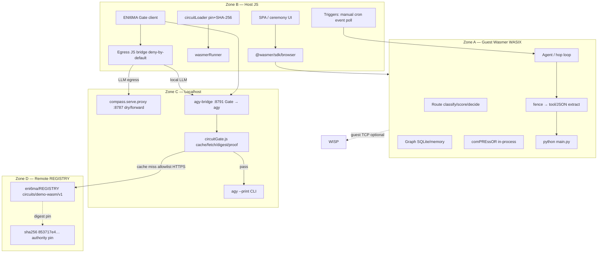

# Wasmer deployment lifecycle & systems stack

**Product:** comPASS (sister to comPREssOR)  
**Package:** `compass-router`  
**Runtime (Phase 3):** browser-only Wasmer appliance + host Gate / agy-bridge  
**Date:** 2026-09-06 (PT)

> **One-sentence model:** A sovereign **browser Wasmer appliance** (guest Python + Route/Graph/comPREssOR) is glued by host JS; world-changing acts and local LLM egress go through an **ENI6MA Gate** on the host **agy-bridge** (loopback) before `agy`.

Normative companions: [`ARCHITECTURE.md`](ARCHITECTURE.md) · [`WASMER.md`](WASMER.md) · [`API.md`](API.md) · ADRs [0005](adr/0005-eni6ma-gated-browser-agent.md) / [0006](adr/0006-generic-llm-adapter.md) / [0007](adr/0007-agy-behind-eni6ma-gate.md) · Gate ABI notes [`../services/agy-bridge/docs/CIRCUIT-ABI.md`](../services/agy-bridge/docs/CIRCUIT-ABI.md).

---

## 1. Zone diagram



| Zone | What | Owns product logic? |
|---|---|---|
| **A — Guest** | Pinned Python, compass core/route/graph, comPREssOR, fence→exec | **Yes** |
| **B — Host JS** | Shell, COOP/COEP, SDK, pins, ceremony UX, triggers, egress bridge | Glue + Gate client |
| **C — Localhost** | Dry proxy `:8787`, agy-bridge Gate `:8791`, `agy` CLI | Egress / local LLM only |
| **D — REGISTRY** | Twin-circuit WASM + `.sha256` sidecars | Authority digests (not CDN host) |

---

## 2. Full lifecycle

### 2.1 Page recall / setup

1. Deliver app shell (SRI), `@wasmer/sdk` + workers, pinned `python/python@=…`, compass + comPREssOR guest packages, twin-circuit binaries, artifact manifest `{ sha256, byteLength, source }` per file.  
2. Host must be cross-origin isolated (`COOP`/`COEP`, `window.crossOriginIsolated === true`).  
3. First hydrate → optional OPFS/IndexedDB cache for offline / sovereign mode (local LLM + local Control ledger).  
4. Pins authority: [`wasmer/artifacts/pins.json`](../wasmer/artifacts/pins.json) — client URLs are hints only.

### 2.2 ENI6MA Gate auth (cache → fetch → digest → proof)

Applies in-browser (`circuitLoader` / Gate client) and on localhost **agy-bridge** (`services/agy-bridge/src/circuitGate.js`):

1. **Cache:** `COMPASS_CIRCUIT_CACHE` or `~/.compass/circuits/`; files named by sha256 hex; `url-index.json` maps URL → sha.  
2. **Fetch (miss):** HTTPS allowlist `raw.githubusercontent.com` / `github.com` only; blob URLs → raw; optional `url+.sha256` sidecar.  
3. **Digest:** recompute SHA-256 (+ length). Sidecar or client pin mismatch → **HTTP 403 fail closed**; never spawn `agy`. Digest is the trust root.  
4. **Proof / ABI:** `WebAssembly.compile` + export inventory (`abi_probe`). DEMO-MINT exports **`build_minimal_proof`** (prove-oriented wasm-bindgen); freestanding verify not present yet — see [`CIRCUIT-ABI.md`](../services/agy-bridge/docs/CIRCUIT-ABI.md).  
5. **Modes:** `digest_ok` / `abi_probe`; `digest_only` when `AGY_GATE_DEV=1` / fail-open after digest; `proof_required` when `AGY_GATE_STRICT=1`.  
6. **Control rule (product):** burn nonce **before** validate (no replay). Gate wraps `policy.update`, `agent.schedule`, `run_python`, LLM/tool/egress.

**Pinned DEMO-MINT circuit:**  
`sha256: 853717e421a36fc93d0791d3f2718ecf3e9c449fb3c60d4084dedab3af75c389`  
Source ref: `eni6ma/REGISTRY@feat/wasm-circuits:circuits/demo-wasm/v1`

### 2.3 Triggers

| Trigger | Zone B mechanism |
|---|---|
| Manual | Run control in the page |
| Cron | In-tab scheduler / SW alarm within policy windows |
| Event | Payload into exposed guest HTTP (`ports.expose`) |
| Poll | Status/payload watch via JS bridge when net allowed |

Start ≠ authorize. Triggers run only under an **already ceremony-bound** policy.

### 2.4 LLM adapter path

Priority (ADR 0006 / [`API.md`](API.md) §6):

**`proxy_override` → `catalog` pin → `decide`** → (optional compress/hop) → bridge → **agy** (or upstream).

| Step | Where |
|---|---|
| Ingress `POST /v1/chat/completions` | Adapter / proxy / agy-bridge |
| Mode resolve | `compass.target` / `model_version_id` / decide |
| Persist | `RouteDecision` + `selection_mode` |
| Hop continuity | comPREssOR forward inject (never shared KV across models) |
| Browser egress | Gate + deny-by-default JS bridge |
| Local LLM | agy-bridge Gate → `agy --print` |
| Strip | Remove `compass` / `circuit` before upstream / CLI |

Dry proxy (no upstream): `python -m compass.serve.proxy --port 8787`.  
agy-bridge: `http://127.0.0.1:8791` (`AGY_BRIDGE_PORT`).

### 2.5 Fence → exec

1. LLM reply arrives (Gate already passed for the call).  
2. Extract Python: markdown fences first (`python` / `py` / bare fence if body looks like Python); close only on matching fence; never exec an open fence.  
3. Fallback: `tool_calls` / `run_python({code})` / JSON `{ "code": "…" }`.  
4. Gate `run_python` (code hash in envelope) → write `main.py` on guest FS → `python /workspace/main.py` → stdout/stderr → Observation.  
5. Prefer file write over `python -c`. Nested sandbox when policy demands stronger isolation.

### 2.6 Persist

| Store | Verdict |
|---|---|
| Guest SQLite / WASIX FS | **Primary** Graph + bandit + sessions |
| In-memory Python | Demos only (lost on refresh) |
| IndexedDB / OPFS ↔ `sandbox.fs` | Optional durable bridge |
| Wasmer Edge managed Postgres | **Out of scope** for Phase 3 product runtime |

Schema: `model-graph/v1` (sibling to compressor `ctx-graph`; do not widen compressor schema).

---

## 3. Module maps

### 3.1 `src/compass/*`

| Path | Role |
|---|---|
| `core/` | WASM-safe classify / score_read / decide_from_snapshot / defaults / abi |
| `route/` | Hot-path decide, classify, envelope |
| `graph.py` + schema | Bitemporal capability graph |
| `score/` | Bandit, reward, attribution, drift |
| `probe/` | Live/offline probe; credentials; **never on prompt path** |
| `ingest/` | Catalog / HF / OpenRouter / Cursor ingest |
| `serve/` | `proxy` (:8787), `adapter`, advisory, governance, orchestrator, sdk |
| `sync/` | Local bundle + paid automation hooks |
| `fleet/` | Paid fleet stub |
| `native/` | Marker: probe/ingest/serve excluded from WASM |

### 3.2 `wasmer/`

| Path | Role |
|---|---|
| `artifacts/compass_core_bg.wasm` | Browser decide (pin in `pins.json`) |
| `artifacts/compass-decide.wasm` | Desktop Wasmer CLI |
| `artifacts/eni6ma/demo-wasm/v1/` | Path-B DEMO-MINT circuit + `pkg/` glue |
| `artifacts/pins.json` | Authority digests |
| `browser/` | `index.html`, `circuitLoader.js`, `wasmerRunner.js`, `bridge.js`, `agent.*`, `sandbox.js` |
| `desktop/` | `run-decide.sh`, `wasmer.toml` |
| `crate/` | Rust → wasm build |
| `mobile/` | **NOT_RUN** device farm |

### 3.3 `services/agy-bridge`

| Path | Role |
|---|---|
| `src/server.js` | Express OpenAI→agy; binds `127.0.0.1` |
| `src/circuitGate.js` | Cache / allowlisted fetch / digest / `abi_probe` / `build_minimal_proof` detection |
| `docs/CIRCUIT-ABI.md` | DEMO-MINT export inventory |
| `docs/client-example.json` | `proxy_override` + circuit example |
| `scripts/smoke-gate.js` / `unit-gate.js` | Gate smoke / unit |

### 3.4 ENI6MA REGISTRY pins

| Artifact | SHA-256 | Role |
|---|---|---|
| `eni6ma_demo_wasm_v1` | `853717e421a36fc93d0791d3f2718ecf3e9c449fb3c60d4084dedab3af75c389` | Circuit minimal proof / DEMO-MINT |
| `compass_core_bg.wasm` | `9ad58acccd85e361baf9a789cdd82e95cb264dd9ddc9691236200c6ceb2507db` | Route decide browser module |

### 3.5 comPREssOR sibling

- Canonical: `soltrinox/comPREssOR` @ **0.2.0** (never archived `CHAT-COMPRESSOR`).  
- In-process in Zone A for hop-safe CC-1..CC-10; adapter calls it on model hop.  
- See [`INTEGRATION.md`](INTEGRATION.md).

---

## 4. ADR table (0005 / 0006 / 0007)

| ADR | Title | Status | One-line decision |
|---|---|---|---|
| [0005](adr/0005-eni6ma-gated-browser-agent.md) | ENI6MA-gated browser agent | Accepted 2026-09-06 PT | Browser-only Wasmer + Gate + JS bridge; no Cursor/IDE primary path |
| [0006](adr/0006-generic-llm-adapter.md) | Generic LLM adapter | Accepted 2026-09-06 PT | Single `/v1/chat/completions`; proxy_override → catalog → decide |
| [0007](adr/0007-agy-behind-eni6ma-gate.md) | agy behind ENI6MA Gate | Accepted 2026-09-06 PT | Bridge runs Gate (cache/fetch/digest/validate) before `agy` |

---

## 5. Ports

| Port | Process | Bind | Purpose |
|---|---|---|---|
| **8787** | `python -m compass.serve.proxy` | `COMPASS_PROXY_HOST` (default localhost) | Dry-run / decide proxy (no keys required for dry) |
| **8791** | agy-bridge (`AGY_BRIDGE_PORT`) | `127.0.0.1` only | Gate → `agy --print` local LLM |
| 8765 | `python3 -m http.server` under `wasmer/` | localhost | Static browser appliance / agent smoke |

---

## 6. Repo tree (deployment-relevant)

```
comPASS/
├── docs/
│   ├── WASMER-DEPLOYMENT.md    ← this file
│   ├── ARCHITECTURE.md WASMER.md API.md STACK.md
│   └── adr/0005…0007
├── src/compass/                # core route graph score probe serve …
├── wasmer/
│   ├── artifacts/ (+ eni6ma/ + pins.json)
│   ├── browser/ desktop/ crate/ mobile/
├── services/agy-bridge/        # Gate + agy loopback
├── scripts/                    # wasmer_* smoke/parity/budget
├── schema/                     # model-graph + bundle mirrors
└── tests/                      # fail-open, wasm boundary, adapter, …
```

Sibling checkout (not in this repo): comPREssOR sibling at soltrinox/comPREssOR.

---

## 7. Security invariants

1. **No** long-lived provider keys in static page, guest image, or WASM module.  
2. Digest pin is authority — **never** trust client-supplied digest without pin store / sidecar match.  
3. Gate **fail closed** on digest mismatch; never spawn `agy` on 403 path.  
4. Host JS bridge **deny-by-default**; proxy override hosts require allowlist / ceremony.  
5. Probe credentials stay off the prompt / Route / WASM path.  
6. Route **fail-open** to configured default on decide errors (distinct from Gate fail-closed).  
7. agy-bridge binds **loopback only**; no provider API keys in Express.  
8. Fetch allowlist: GitHub raw hosts only for circuit miss.  
9. Strip `compass` / `circuit` before upstream forward or CLI.  
10. Burn-before-validate for real Control ledger (product rule; stub → real ABI over time).

---

## 8. Built vs outstanding

| Built | Outstanding |
|---|---|
| Offline Route/Graph/Probe libraries + tests | Full ceremony UX + Control burn ledger in-tab |
| Wasmer browser/desktop decide artifacts + size budget | Real ENI6MA verify export / official wbindgen glue in Node Gate |
| Browser Path-B `circuitLoader` + `wasmerRunner` stub | Nested sandbox policy automation |
| ADR 0005/0006/0007 + adapter API section 6 | Production page-recall CDN + SRI pipeline |
| agy-bridge Gate: cache/fetch/digest/`abi_probe` | `AGY_GATE_STRICT` default in prod profiles |
| DEMO-MINT pin `853717e4…` + CIRCUIT-ABI.md | Mobile device farm (NOT_RUN) |
| Proxy dry-run :8787; bridge :8791 | Edge Postgres as agent DB — explicitly non-goal |

---

## 9. Operator cheat sheet

| Task | Command |
|---|---|
| Browser decide smoke | Install Playwright under wasmer/browser then run node scripts/wasmer_browser_smoke.mjs from repo root |
| Desktop decide | ./wasmer/desktop/run-decide.sh |
| Size budget | python scripts/wasmer_size_budget.py |
| Parity | python scripts/wasmer_parity.py |
| Dry proxy port 8787 | python -m compass.serve.proxy --port 8787 |
| Start agy-bridge port 8791 | From services/agy-bridge: node src/server.js with AGY_GATE_DEV and AGY_FAIL_OPEN set |
| Gate smoke | node scripts/smoke-gate.js under services/agy-bridge |
| Static agent page | Serve wasmer/ via python3 -m http.server 8765 and open browser/agent.html |
| Show pins | cat wasmer/artifacts/pins.json |

DEMO-MINT pin: 853717e421a36fc93d0791d3f2718ecf3e9c449fb3c60d4084dedab3af75c389

Bridge env: AGY_BIN, AGY_BRIDGE_PORT, AGY_GATE_DEV, AGY_GATE_STRICT, AGY_GATE_REQUIRED, AGY_FAIL_OPEN, COMPASS_CIRCUIT_CACHE.

---

## 10. Related docs

| Doc | Role |
|---|---|
| [`ARCHITECTURE.md`](ARCHITECTURE.md) | Zones, planes, Gate authority, persistence |
| [`API.md`](API.md) | Route + adapter section 6 + agy-bridge section 7 |
| [`WASMER.md`](WASMER.md) | Artifacts, ABI, CI matrix, historical Track D |
| [`STACK.md`](STACK.md) | Language/deps; Phase 1-2 layout superseded |
| [`adr/0005-eni6ma-gated-browser-agent.md`](adr/0005-eni6ma-gated-browser-agent.md) | Browser + Gate decision |
| [`adr/0006-generic-llm-adapter.md`](adr/0006-generic-llm-adapter.md) | Selection modes |
| [`adr/0007-agy-behind-eni6ma-gate.md`](adr/0007-agy-behind-eni6ma-gate.md) | Bridge Gate decision |
| [`../services/agy-bridge/README.md`](../services/agy-bridge/README.md) | Operator env / request shape |
| [`../services/agy-bridge/docs/CIRCUIT-ABI.md`](../services/agy-bridge/docs/CIRCUIT-ABI.md) | DEMO-MINT ABI probe notes |
| [`../wasmer/browser/README.agent.md`](../wasmer/browser/README.agent.md) | Path-B loader/runner stub |
